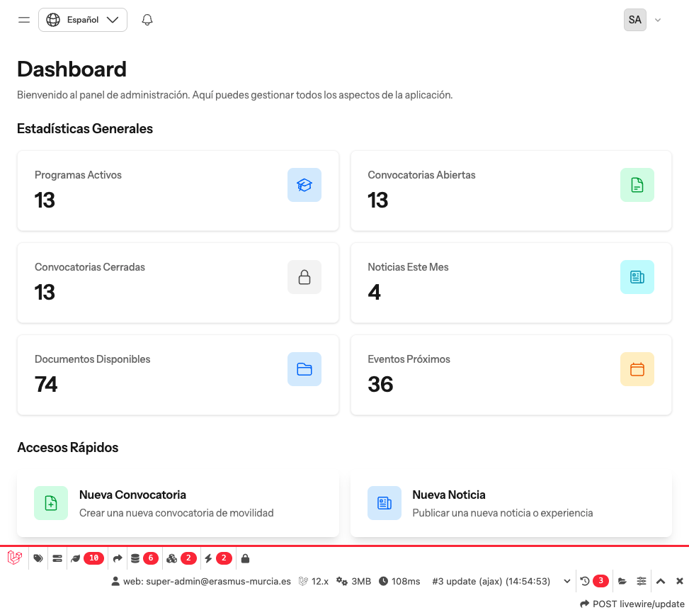

# Erasmus+ Centro (Murcia)

[](https://laravel.com)
[](https://php.net)
[](https://livewire.laravel.com)
[](https://tailwindcss.com)
[](tests/)
[](LICENSE)

Portal web para la gestión centralizada de programas Erasmus+ de un centro educativo. Permite gestionar convocatorias de movilidad, noticias, documentos, eventos y suscripciones al boletín informativo.



## Características Principales

### Área Pública
- Consulta de programas Erasmus+ (Educación Escolar, FP, Educación Superior)
- Listado de convocatorias con fases y resoluciones
- Noticias con editor enriquecido y etiquetas
- Documentos descargables organizados por categorías
- Calendario de eventos interactivo
- Suscripción a newsletter con verificación por email
- Multilingüe (Español/Inglés)

### Panel de Administración
- Dashboard con estadísticas y gráficos en tiempo real
- CRUD completo para todas las entidades
- Gestión de usuarios y roles (4 niveles)
- Sistema de auditoría completo
- Importación/Exportación de datos (Excel)
- Notificaciones automáticas
- Búsqueda global unificada

---

## Requisitos del Sistema

| Requisito | Versión Mínima |
|-----------|----------------|
| PHP | 8.2+ (recomendado 8.3) |
| MySQL | 8.0+ |
| Node.js | 18+ |
| Composer | 2.x |
| NPM | 9+ |

### Extensiones PHP Requeridas

```
bcmath, ctype, curl, dom, fileinfo, gd, json, mbstring, 
openssl, pcre, pdo, pdo_mysql, tokenizer, xml, zip
```

---

## Instalación

### 1. Clonar el Repositorio

```bash
git clone https://github.com/tu-usuario/erasmus25.git
cd erasmus25
```

### 2. Instalar Dependencias

```bash
# Dependencias PHP
composer install

# Dependencias JavaScript
npm install
```

### 3. Configurar el Entorno

```bash
# Copiar archivo de configuración
cp .env.example .env

# Generar clave de aplicación
php artisan key:generate
```

### 4. Configurar la Base de Datos

Edita el archivo `.env` con tus credenciales:

```env
DB_CONNECTION=mysql
DB_HOST=127.0.0.1
DB_PORT=3306
DB_DATABASE=erasmus25
DB_USERNAME=tu_usuario
DB_PASSWORD=tu_contraseña
```

### 5. Ejecutar Migraciones y Seeders

```bash
# Crear tablas y datos de prueba
php artisan migrate --seed
```

### 6. Compilar Assets

```bash
# Para desarrollo
npm run dev

# Para producción
npm run build
```

### 7. Enlace de Almacenamiento

```bash
php artisan storage:link
```

---

## Configuración

### Variables de Entorno Principales

```env
# Aplicación
APP_NAME="Erasmus+ Centro"
APP_ENV=local
APP_DEBUG=true
APP_URL=http://erasmus25.test
APP_LOCALE=es

# Base de Datos
DB_CONNECTION=mysql
DB_DATABASE=erasmus25

# Correo (para newsletter y notificaciones)
MAIL_MAILER=smtp
MAIL_HOST=smtp.ejemplo.com
MAIL_PORT=587
MAIL_USERNAME=tu_usuario
MAIL_PASSWORD=tu_contraseña
MAIL_FROM_ADDRESS=erasmus@centro.es
MAIL_FROM_NAME="Erasmus+ Centro"
```

### Configuración de Laravel Herd (macOS)

Si usas Laravel Herd, la aplicación estará disponible automáticamente en:

```
https://erasmus25.test
```

No necesitas ejecutar ningún servidor adicional.

---

## Uso

### Credenciales de Prueba

El seeder crea usuarios de prueba para cada rol:

| Rol | Email | Contraseña |
|-----|-------|------------|
| Super Admin | super-admin@erasmus-murcia.es | password |
| Admin | admin@erasmus-murcia.es | password |
| Editor | editor@erasmus-murcia.es | password |
| Viewer | viewer@erasmus-murcia.es | password |

### URLs Principales

| Área | URL | Descripción |
|------|-----|-------------|
| Inicio | `/` | Página principal pública |
| Programas | `/programas` | Listado de programas |
| Convocatorias | `/convocatorias` | Listado de convocatorias |
| Noticias | `/noticias` | Listado de noticias |
| Documentos | `/documentos` | Documentos descargables |
| Eventos | `/eventos` | Calendario de eventos |
| **Panel Admin** | `/admin` | Dashboard de administración |
| Login | `/login` | Inicio de sesión |

### Roles y Permisos

| Rol | Descripción |
|-----|-------------|
| **Super Admin** | Acceso total al sistema |
| **Admin** | Gestión completa de contenido, usuarios y configuración |
| **Editor** | Crear y editar contenido (sin publicar ni eliminar) |
| **Viewer** | Solo lectura del panel de administración |

---

## Testing

### Ejecutar Todos los Tests

```bash
php artisan test
```

### Ejecutar Tests Específicos

```bash
# Por archivo
php artisan test tests/Feature/ExampleTest.php

# Por nombre
php artisan test --filter="test_example"

# En paralelo (más rápido)
php artisan test --parallel
```

### Estado Actual de Tests

- **Total**: 3,867+ tests
- **Assertions**: 8,793+
- **Cobertura**: 100% en modelos, policies, form requests y componentes Livewire

---

## Estructura del Proyecto

```
erasmus25/
├── app/
│   ├── Constants/          # Constantes (Roles, Permisos)
│   ├── Exports/            # Exportaciones Excel
│   ├── Http/
│   │   ├── Requests/       # Form Requests (validación)
│   │   └── Middleware/     # Middleware personalizado
│   ├── Imports/            # Importaciones Excel
│   ├── Livewire/           # Componentes Livewire
│   │   ├── Admin/          # Panel de administración
│   │   └── Public/         # Área pública
│   ├── Models/             # Modelos Eloquent
│   ├── Observers/          # Observers para eventos de modelos
│   ├── Policies/           # Policies de autorización
│   ├── Services/           # Servicios de negocio
│   └── Support/            # Helpers y utilidades
├── config/                 # Configuración de la aplicación
├── database/
│   ├── factories/          # Factories para testing
│   ├── migrations/         # Migraciones de BD
│   └── seeders/            # Seeders de datos
├── docs/                   # Documentación técnica
├── resources/
│   ├── css/                # Estilos (Tailwind)
│   ├── js/                 # JavaScript (Alpine, Chart.js)
│   └── views/              # Vistas Blade y Livewire
├── routes/                 # Definición de rutas
├── storage/                # Archivos subidos y caché
└── tests/                  # Tests automatizados
```

---

## Tecnologías Utilizadas

### Backend
- **Laravel 12** - Framework PHP
- **Livewire 3** - Componentes reactivos
- **Laravel Fortify** - Autenticación
- **Spatie Permission** - Roles y permisos
- **Spatie Media Library** - Gestión de archivos
- **Spatie Activitylog** - Auditoría
- **Laravel Excel** - Importación/Exportación

### Frontend
- **Flux UI v2** - Componentes UI
- **Tailwind CSS v4** - Framework CSS
- **Alpine.js** - Interactividad JavaScript
- **Chart.js** - Gráficos
- **Tiptap** - Editor de texto enriquecido
- **FilePond** - Upload de archivos

### Testing
- **Pest PHP v4** - Framework de testing

---

## Documentación

La documentación completa está disponible en la carpeta [`docs/`](docs/README.md):

- **[Guía de Usuario](docs/guia-usuario/README.md)** - Guías para administradores y editores
- **[Documentación Técnica](docs/README.md)** - Arquitectura, modelos, APIs
- **[Flujos de Trabajo](docs/flujos-trabajo.md)** - Procesos operativos
- **[Roles y Permisos](docs/roles-and-permissions.md)** - Sistema de autorización

---

## Desarrollo

### Comandos Útiles

```bash
# Iniciar entorno de desarrollo (servidor + vite + queue + logs)
composer run dev

# Ejecutar linter de código
./vendor/bin/pint

# Limpiar caché
php artisan cache:clear
php artisan config:clear
php artisan view:clear

# Regenerar caché de configuración
php artisan config:cache
php artisan route:cache
php artisan view:cache

# Regenerar conversiones de imágenes
php artisan media-library:regenerate
```

### Crear Usuario Administrador

```bash
php artisan tinker
```

```php
$user = \App\Models\User::create([
    'name' => 'Administrador',
    'email' => 'admin@ejemplo.com',
    'password' => bcrypt('contraseña-segura'),
]);
$user->assignRole('admin');
```

---

## Contribuir

1. Fork del repositorio
2. Crear rama de feature (`git checkout -b feature/nueva-funcionalidad`)
3. Commit de cambios (`git commit -am 'Añadir nueva funcionalidad'`)
4. Push a la rama (`git push origin feature/nueva-funcionalidad`)
5. Crear Pull Request

### Estándares de Código

- Seguir PSR-12 (ejecutar `./vendor/bin/pint` antes de commit)
- Tests para toda nueva funcionalidad
- Documentación de cambios significativos

---

## Licencia

Este proyecto está bajo la Licencia MIT. Ver el archivo [LICENSE](LICENSE) para más detalles.

---

## Créditos

Desarrollado como proyecto de gestión de programas Erasmus+ para centros educativos.

### Agradecimientos

- [Laravel](https://laravel.com) - Framework PHP
- [Livewire](https://livewire.laravel.com) - Componentes reactivos
- [Flux UI](https://fluxui.dev) - Biblioteca de componentes
- [Spatie](https://spatie.be) - Paquetes de Laravel
- [Tailwind CSS](https://tailwindcss.com) - Framework CSS

---

**Última actualización**: Enero 2026
