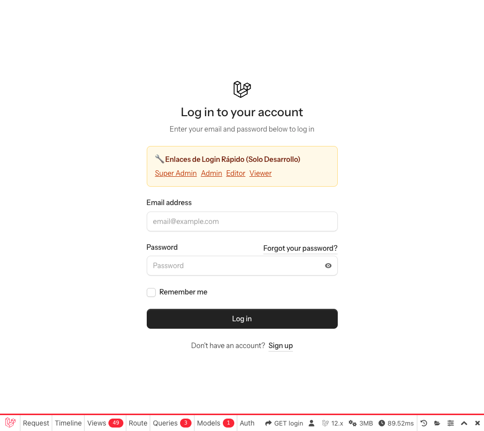
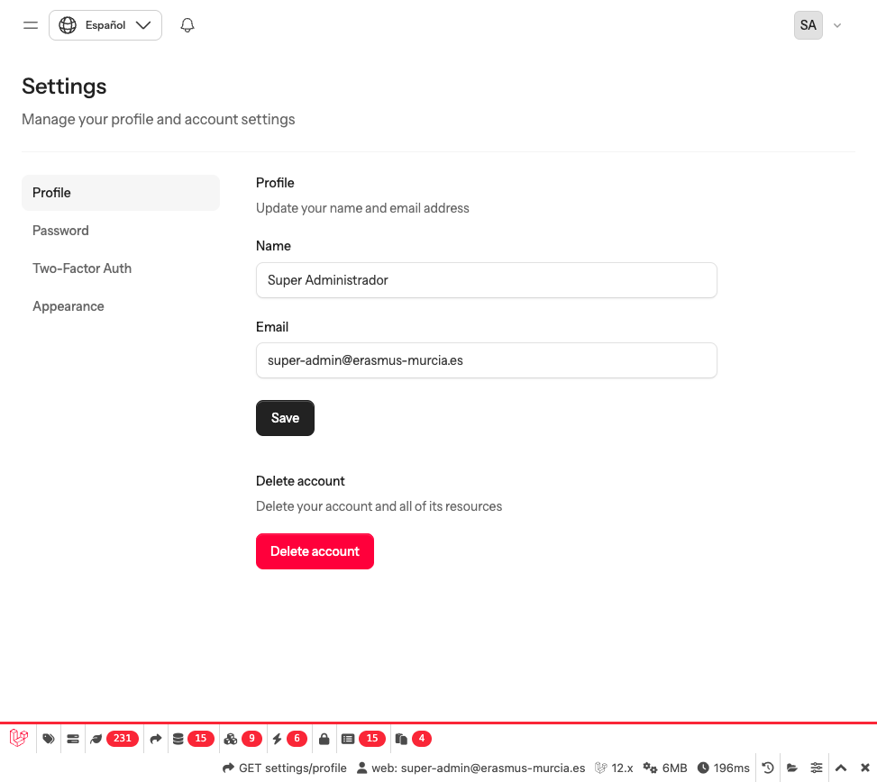
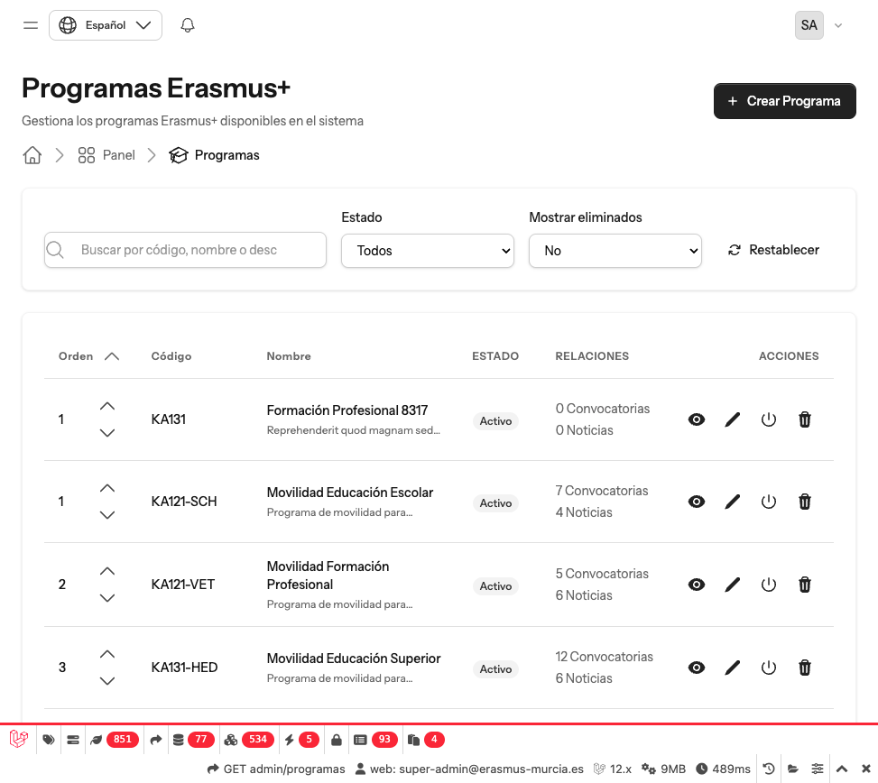
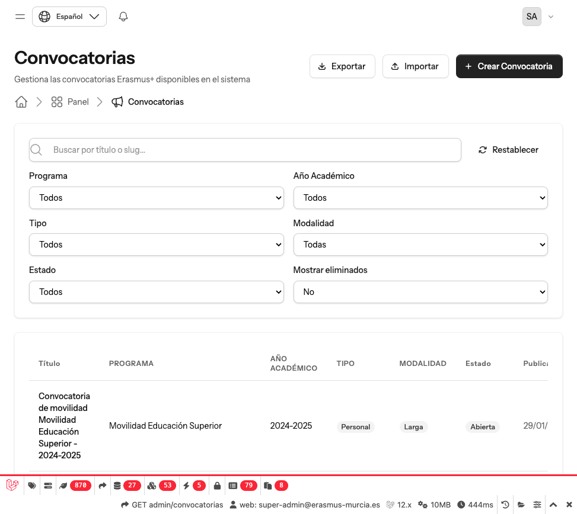
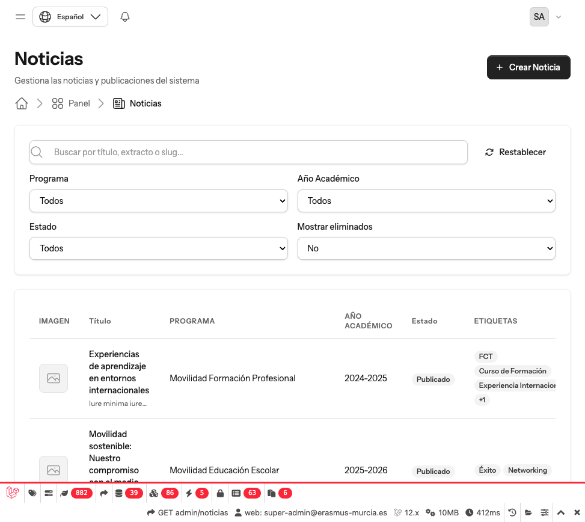
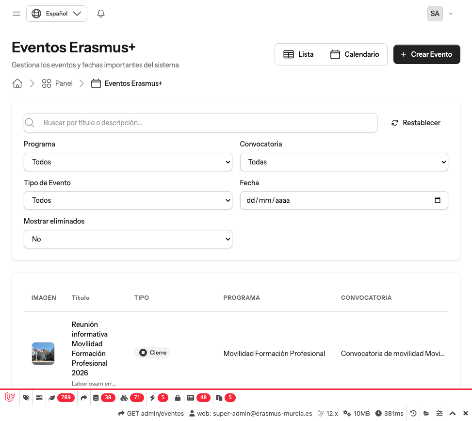
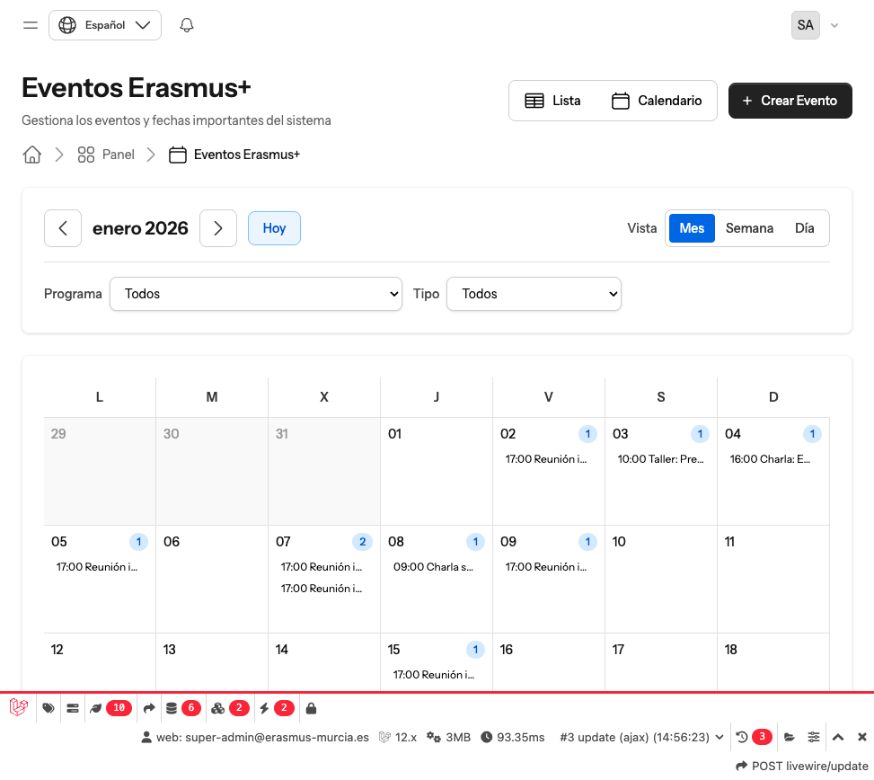
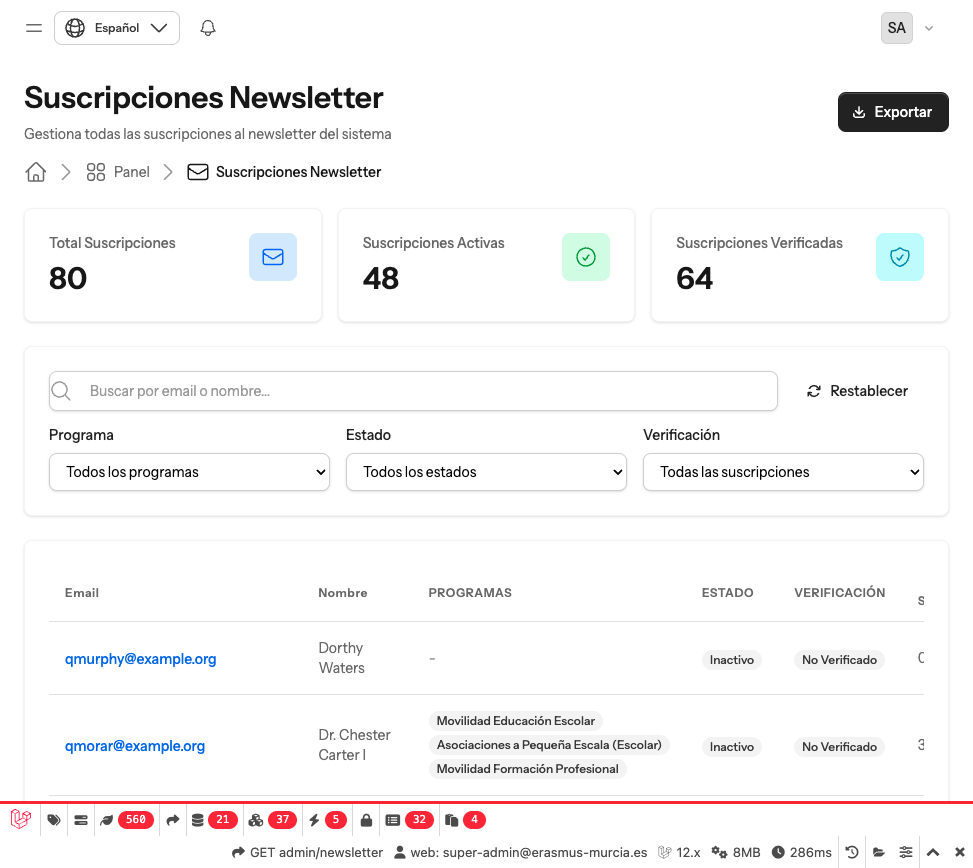
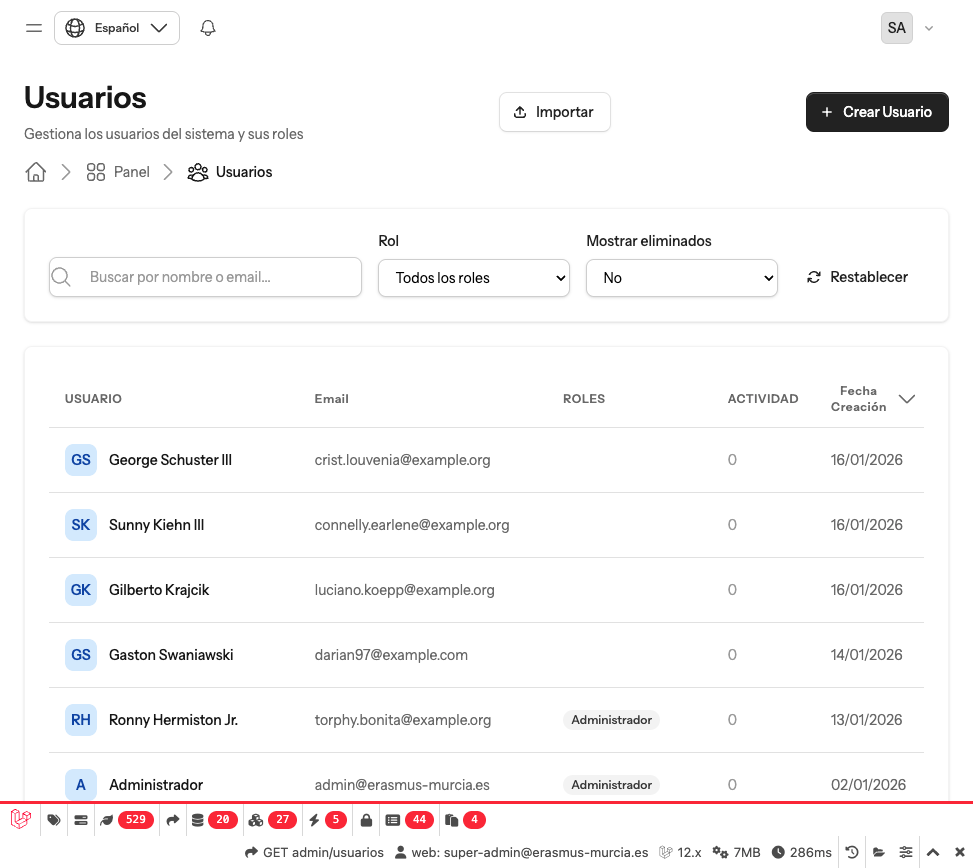
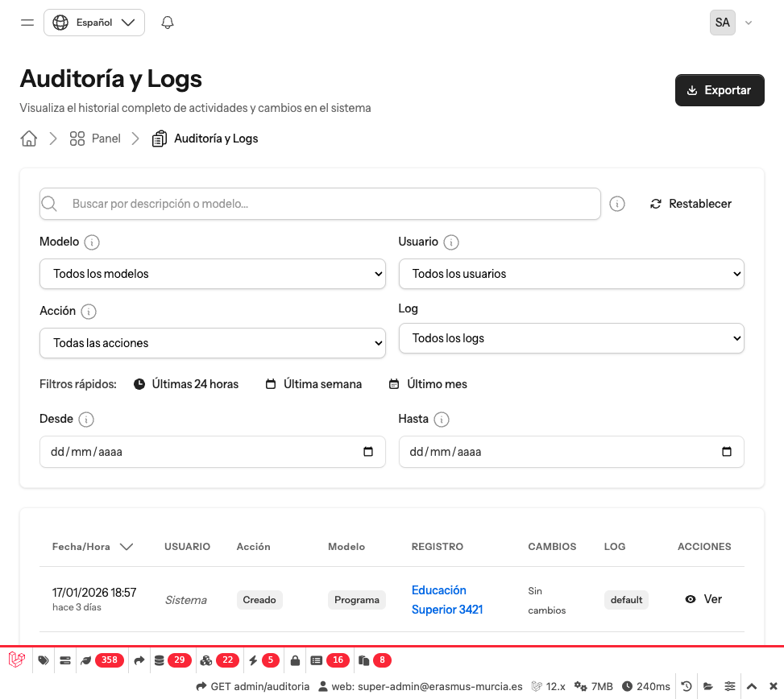

# Guía de Administrador - Erasmus+ Centro (Murcia)

Esta guía está dirigida a usuarios con roles de **Super Administrador** y **Administrador** del portal Erasmus+ Centro (Murcia).

---

## Índice

1. [Introducción al Sistema](#1-introducción-al-sistema)
2. [Acceso y Autenticación](#2-acceso-y-autenticación)
3. [Interfaz General](#3-interfaz-general)
4. [Perfil de Usuario](#4-perfil-de-usuario)
5. [Dashboard de Administración](#5-dashboard-de-administración)
6. [Gestión de Programas](#6-gestión-de-programas)
7. [Gestión de Convocatorias](#7-gestión-de-convocatorias)
8. [Gestión de Noticias](#8-gestión-de-noticias)
9. [Gestión de Documentos](#9-gestión-de-documentos)
10. [Gestión de Eventos](#10-gestión-de-eventos)
11. [Gestión de Newsletter](#11-gestión-de-newsletter)
12. [Gestión de Usuarios](#12-gestión-de-usuarios)
13. [Gestión de Roles y Permisos](#13-gestión-de-roles-y-permisos)
14. [Configuración del Sistema](#14-configuración-del-sistema)
15. [Traducciones](#15-traducciones)
16. [Auditoría y Logs](#16-auditoría-y-logs)

---

## 1. Introducción al Sistema

### 1.1. ¿Qué es Erasmus+ Centro (Murcia)?

**Erasmus+ Centro (Murcia)** es una aplicación web diseñada para centralizar y gestionar toda la información relacionada con los programas Erasmus+ de un centro educativo. El portal sirve como punto único de información tanto para el público general como para el personal administrativo del centro.

### 1.2. Programas Erasmus+ Soportados

La aplicación gestiona tres tipos principales de programas Erasmus+:

| Programa | Código | Descripción |
|----------|--------|-------------|
| **Educación Escolar** | KA1xx | Movilidades escolares y de personal docente |
| **Formación Profesional** | KA121-VET | FCT, prácticas profesionales, job shadowing, cursos de formación |
| **Educación Superior** | KA131-HED | Movilidad de estudios, prácticas y personal universitario |

### 1.3. Áreas de la Aplicación

La aplicación se divide en dos áreas principales:

#### Área Pública (Front-office)

Accesible sin autenticación. Permite a cualquier visitante:

- Consultar información sobre los programas Erasmus+
- Ver las convocatorias publicadas y sus resoluciones
- Leer las noticias relacionadas con Erasmus+
- Descargar documentos públicos
- Consultar el calendario de eventos
- Suscribirse al boletín informativo (newsletter)

#### Panel de Administración (Back-office)

Accesible solo para usuarios autenticados. Según tu rol, podrás:

- Gestionar programas, convocatorias, noticias, documentos y eventos
- Publicar y despublicar contenido
- Administrar usuarios y roles (solo super-admin)
- Configurar el sistema
- Consultar los registros de auditoría

### 1.4. Requisitos del Sistema

Para utilizar correctamente la aplicación, necesitas:

| Requisito | Especificación |
|-----------|----------------|
| **Navegador** | Chrome 90+, Firefox 88+, Safari 14+, Edge 90+ |
| **JavaScript** | Habilitado (necesario para la interfaz) |
| **Cookies** | Habilitadas (necesarias para la sesión) |
| **Resolución** | Mínimo 1024x768 (recomendado 1280x800 o superior) |
| **Conexión** | Internet estable |

> **Nota:** La aplicación es totalmente responsive y puede utilizarse en dispositivos móviles y tabletas, aunque para tareas de administración se recomienda usar un ordenador de escritorio o portátil.

### 1.5. URL de Acceso

La aplicación está disponible en la siguiente dirección:

```
https://erasmus25.test
```

> **Nota:** Esta URL corresponde al entorno de desarrollo. En producción, la URL será diferente y te será proporcionada por el administrador del sistema.

### 1.6. Idiomas Disponibles

La aplicación está disponible en dos idiomas:

- **Español** (ES) - Idioma predeterminado
- **Inglés** (EN)

Puedes cambiar el idioma en cualquier momento desde el selector de idioma ubicado en la barra de navegación superior.

### 1.7. Tu Rol como Administrador

Como usuario con rol de **Administrador** o **Super Administrador**, tienes acceso a funcionalidades avanzadas que no están disponibles para otros usuarios:

| Funcionalidad | Admin | Super Admin |
|---------------|:-----:|:-----------:|
| Ver contenido | ✅ | ✅ |
| Crear contenido | ✅ | ✅ |
| Editar contenido | ✅ | ✅ |
| Eliminar contenido | ✅ | ✅ |
| Publicar contenido | ✅ | ✅ |
| Gestionar usuarios | ❌ | ✅ |
| Gestionar roles | ❌ | ✅ |
| Configuración del sistema | ✅ | ✅ |
| Ver auditoría | ✅ | ✅ |
| Eliminación permanente | ❌ | ✅ |

> **Importante:** La diferencia principal entre Admin y Super Admin es que solo el Super Admin puede gestionar usuarios, roles y realizar eliminaciones permanentes de registros.

---

## 2. Acceso y Autenticación

### 2.1. Iniciar Sesión



Para acceder al panel de administración, sigue estos pasos:

1. Abre tu navegador y accede a la URL del portal
2. Serás redirigido automáticamente a la página de inicio de sesión

#### Pantalla de Inicio de Sesión


La pantalla de inicio de sesión contiene los siguientes elementos:

| Campo | Descripción |
|-------|-------------|
| **Correo electrónico** | Tu dirección de email registrada en el sistema |
| **Contraseña** | Tu contraseña de acceso |
| **Recordarme** | Marca esta opción para mantener la sesión activa durante más tiempo |
| **¿Olvidaste tu contraseña?** | Enlace para recuperar tu contraseña |

#### Pasos para Iniciar Sesión

1. Introduce tu **correo electrónico** en el campo correspondiente
2. Introduce tu **contraseña**
3. (Opcional) Marca la casilla **"Recordarme"** si deseas mantener la sesión
4. Haz clic en el botón **"Iniciar sesión"**

> **Nota:** Si tienes activada la autenticación de dos factores (2FA), después de introducir tus credenciales se te pedirá un código de verificación adicional.

#### Errores Comunes

| Error | Causa | Solución |
|-------|-------|----------|
| "Credenciales incorrectas" | Email o contraseña incorrectos | Verifica que los datos sean correctos |
| "Demasiados intentos" | Has superado el límite de intentos | Espera unos minutos antes de intentar de nuevo |
| "Cuenta no verificada" | Tu email no ha sido verificado | Revisa tu bandeja de entrada para el email de verificación |

---

### 2.2. Recuperar Contraseña

Si has olvidado tu contraseña, puedes recuperarla fácilmente:

#### Paso 1: Solicitar Restablecimiento

1. En la pantalla de inicio de sesión, haz clic en **"¿Olvidaste tu contraseña?"**
2. Introduce tu **correo electrónico** registrado
3. Haz clic en **"Enviar enlace de restablecimiento"**


#### Paso 2: Revisar tu Correo

1. Revisa tu bandeja de entrada (también la carpeta de spam)
2. Busca un email con el asunto "Restablecer contraseña"
3. Haz clic en el enlace del email

> **Importante:** El enlace de restablecimiento caduca en **60 minutos**. Si no lo usas a tiempo, deberás solicitar uno nuevo.

#### Paso 3: Crear Nueva Contraseña

1. Introduce tu nueva contraseña
2. Confirma la nueva contraseña
3. Haz clic en **"Restablecer contraseña"**

**Requisitos de la contraseña:**
- Mínimo 8 caracteres
- Se recomienda incluir mayúsculas, minúsculas, números y símbolos

---

### 2.3. Autenticación de Dos Factores (2FA)

La autenticación de dos factores añade una capa extra de seguridad a tu cuenta. Cuando está activada, además de tu contraseña, necesitarás introducir un código temporal generado por una aplicación en tu teléfono móvil.

#### ¿Qué es el 2FA?

El 2FA (Two-Factor Authentication) requiere dos elementos para verificar tu identidad:

1. **Algo que sabes**: Tu contraseña
2. **Algo que tienes**: Tu teléfono móvil con la aplicación de autenticación

#### Aplicaciones de Autenticación Recomendadas

Puedes usar cualquiera de estas aplicaciones gratuitas:

| Aplicación | Disponible en |
|------------|---------------|
| **Google Authenticator** | iOS, Android |
| **Microsoft Authenticator** | iOS, Android |
| **Authy** | iOS, Android, Escritorio |
| **1Password** | iOS, Android, Escritorio |

#### Iniciar Sesión con 2FA Activado

Si tienes el 2FA activado, después de introducir tu email y contraseña:

1. Se mostrará la pantalla de verificación 2FA
2. Abre la aplicación de autenticación en tu teléfono
3. Busca la entrada "Erasmus+ Centro" o similar
4. Introduce el **código de 6 dígitos** que muestra la aplicación
5. Haz clic en **"Continuar"**


> **Nota:** Los códigos se renuevan cada 30 segundos. Si el código está a punto de caducar, espera al siguiente.

#### Usar un Código de Recuperación

Si no tienes acceso a tu teléfono, puedes usar un código de recuperación:

1. En la pantalla de verificación 2FA, haz clic en **"usar un código de recuperación"**
2. Introduce uno de tus códigos de recuperación guardados
3. Haz clic en **"Continuar"**

> **Importante:** Cada código de recuperación solo puede usarse **una vez**. Después de usarlo, ese código ya no será válido.

---

### 2.4. Cerrar Sesión

Para cerrar tu sesión de forma segura:

1. Haz clic en tu **nombre de usuario** o **avatar** en la esquina superior derecha
2. En el menú desplegable, selecciona **"Cerrar sesión"**

> **Recomendación:** Siempre cierra sesión cuando uses un ordenador compartido o público.

---

### 2.5. Sesión Expirada

Por motivos de seguridad, tu sesión puede expirar después de un período de inactividad. Si esto ocurre:

1. Serás redirigido automáticamente a la página de inicio de sesión
2. Verás un mensaje indicando que tu sesión ha expirado
3. Inicia sesión nuevamente para continuar

> **Nota:** Si marcaste la opción "Recordarme" al iniciar sesión, tu sesión durará más tiempo antes de expirar.

---

## 3. Interfaz General

Una vez que hayas iniciado sesión, verás el panel de administración. Esta sección te ayudará a familiarizarte con los elementos principales de la interfaz.

### 3.1. Estructura de la Pantalla

El panel de administración está organizado en varias zonas:

```
┌──────────────────────────────────────────────────────────────┐
│                     BARRA SUPERIOR                           │
│  [Logo]  [Búsqueda Global]           [Idioma] [Usuario ▼]    │
├──────────────┬───────────────────────────────────────────────┤
│              │                                               │
│   SIDEBAR    │              ÁREA DE CONTENIDO                │
│   (Menú)     │                                               │
│              │    [Breadcrumbs]                              │
│  Dashboard   │                                               │
│  ─────────   │    Título de la Sección                       │
│  Contenido   │                                               │
│  • Programas │    (Contenido principal de la página)         │
│  • Convoc.   │                                               │
│  • Noticias  │                                               │
│  • Docs      │                                               │
│  • Eventos   │                                               │
│  ─────────   │                                               │
│  Sistema     │                                               │
│  • Usuarios  │                                               │
│  • Config    │                                               │
│              │                                               │
└──────────────┴───────────────────────────────────────────────┘
```


---

### 3.2. Barra Lateral (Sidebar)

El sidebar contiene el menú principal de navegación, organizado en grupos:

#### Grupo "Platform"
| Elemento | Descripción |
|----------|-------------|
| **Dashboard** | Página principal con estadísticas y resumen |

#### Grupo "Contenido"
| Elemento | Descripción |
|----------|-------------|
| **Programas** | Gestión de programas Erasmus+ |
| **Convocatorias** | Gestión de convocatorias, fases y resoluciones |
| **Noticias** | Gestión de noticias del portal |
| **Etiquetas** | Gestión de etiquetas para clasificar noticias |
| **Documentos** | Gestión de documentos descargables |
| **Categorías** | Gestión de categorías de documentos |
| **Eventos** | Gestión del calendario de eventos |

#### Grupo "Gestión"
| Elemento | Descripción |
|----------|-------------|
| **Años Académicos** | Gestión de años académicos |

#### Grupo "Sistema" (solo administradores)
| Elemento | Descripción |
|----------|-------------|
| **Usuarios** | Gestión de usuarios del sistema |
| **Roles y Permisos** | Configuración de roles |
| **Configuración** | Ajustes generales del sistema |
| **Traducciones** | Gestión de textos traducibles |
| **Auditoría** | Registro de actividad del sistema |
| **Newsletter** | Gestión de suscriptores |

> **Nota:** Los elementos del menú que aparecen dependen de tus permisos. Si no ves alguna opción, es porque tu rol no tiene acceso a esa funcionalidad.

#### Contraer el Sidebar

Puedes contraer el sidebar para tener más espacio de trabajo:

1. Haz clic en el icono de **menú hamburguesa** (≡) en la parte superior
2. El sidebar se contraerá mostrando solo los iconos
3. Haz clic de nuevo para expandirlo

En dispositivos móviles, el sidebar se oculta automáticamente y aparece como un menú desplegable.

---

### 3.3. Breadcrumbs (Migas de Pan)

Los breadcrumbs son la barra de navegación que aparece en la parte superior del contenido. Te muestran dónde estás y te permiten navegar hacia atrás fácilmente.

**Ejemplo:**

```
Dashboard > Convocatorias > Movilidad KA1 2024 > Editar
```

Cada elemento es un enlace que puedes hacer clic para volver a esa sección.

#### Cómo leer los Breadcrumbs

| Elemento | Significado |
|----------|-------------|
| **Dashboard** | Página principal de administración |
| **Convocatorias** | Listado de convocatorias |
| **Movilidad KA1 2024** | Detalle de una convocatoria específica |
| **Editar** | Acción actual (edición) |

#### Iconos en Breadcrumbs

Los breadcrumbs incluyen iconos para identificar rápidamente cada sección:

| Icono | Sección |
|-------|---------|
| □ (cuadrados) | Dashboard |
| 🎓 (birrete) | Programas |
| 📢 (megáfono) | Convocatorias |
| 📰 (periódico) | Noticias |
| 📄 (documento) | Documentos |
| 📅 (calendario) | Eventos |
| 👥 (personas) | Usuarios |
| ⚙️ (engranaje) | Configuración |

---

### 3.4. Búsqueda Global

La búsqueda global te permite encontrar rápidamente cualquier contenido en el sistema.

#### Acceder a la Búsqueda

1. Haz clic en **"Búsqueda Global"** en el sidebar, o
2. Usa el atajo de teclado (si está disponible)


#### Tipos de Contenido que Puedes Buscar

- **Programas**: Por nombre, descripción o código
- **Convocatorias**: Por título o requisitos
- **Noticias**: Por título, resumen o contenido
- **Documentos**: Por título o descripción

#### Usar los Filtros Avanzados

1. Escribe tu término de búsqueda en el campo
2. Haz clic en **"Filtros avanzados"** para más opciones
3. Puedes filtrar por:
   - **Tipo de contenido**: Marca/desmarca los tipos que quieres buscar
   - **Programa**: Filtra por un programa específico
   - **Año académico**: Filtra por año

#### Resultados de Búsqueda

Los resultados se muestran agrupados por tipo:

- Cada resultado muestra información relevante (título, descripción breve)
- Haz clic en un resultado para ir directamente a su página de edición
- El número junto a cada tipo indica cuántos resultados hay

---

### 3.5. Selector de Idioma

Puedes cambiar el idioma de la interfaz en cualquier momento:

1. Localiza el **selector de idioma** en el sidebar (parte inferior) o en la barra superior
2. Haz clic en él para ver los idiomas disponibles
3. Selecciona el idioma deseado

**Idiomas disponibles:**
- 🇪🇸 **Español** (ES)
- 🇬🇧 **Inglés** (EN)

> **Nota:** El cambio de idioma afecta a toda la interfaz inmediatamente. El contenido que hayas creado (noticias, descripciones, etc.) mantiene su idioma original.

---

### 3.6. Menú de Usuario

En la esquina superior derecha (o en la parte inferior del sidebar en móvil), encontrarás tu menú de usuario:

1. Haz clic en tu **nombre** o **avatar**
2. Se desplegará un menú con las siguientes opciones:

| Opción | Descripción |
|--------|-------------|
| **Configuración** | Accede a tu perfil y preferencias |
| **Cerrar sesión** | Cierra tu sesión de forma segura |

---

### 3.7. Notificaciones

El sistema te notifica automáticamente cuando ocurren eventos importantes:

#### Icono de Notificaciones

En la barra superior verás un icono de campana (🔔). Si hay notificaciones pendientes, verás un número indicando cuántas son.

#### Ver Notificaciones

1. Haz clic en el icono de **campana** (🔔)
2. Se desplegará una lista con las notificaciones recientes
3. Haz clic en una notificación para ir al contenido relacionado

#### Tipos de Notificaciones

| Tipo | Cuándo se genera |
|------|------------------|
| **Nueva convocatoria** | Cuando se publica una convocatoria |
| **Nueva resolución** | Cuando se publica una resolución |
| **Nueva noticia** | Cuando se publica una noticia |

#### Marcar como Leídas

- Haz clic en una notificación para marcarla como leída
- O usa el botón **"Marcar todas como leídas"** en el menú

> **Nota:** Las notificaciones se actualizan automáticamente cada 30 segundos.

---

### 3.8. Modo Claro / Oscuro

La aplicación soporta modo claro y modo oscuro. Para cambiar entre ellos:

1. Ve a **Configuración** → **Apariencia**
2. Selecciona tu preferencia:
   - **Claro**: Fondo blanco, texto oscuro
   - **Oscuro**: Fondo oscuro, texto claro
   - **Sistema**: Sigue la configuración de tu sistema operativo

---

### 3.9. Atajos de Teclado

Algunos atajos útiles para navegar más rápido:

| Atajo | Acción |
|-------|--------|
| `Tab` | Navegar entre elementos del formulario |
| `Enter` | Confirmar acción / Enviar formulario |
| `Escape` | Cerrar modal / Cancelar acción |

---

### 3.10. Responsive: Uso en Móviles y Tablets

La interfaz se adapta automáticamente al tamaño de tu pantalla:

#### En Móviles
- El sidebar se oculta y aparece como menú desplegable
- Los formularios se muestran en una sola columna
- Las tablas pueden desplazarse horizontalmente

#### En Tablets
- El sidebar puede contraerse para más espacio
- Los formularios se adaptan a 2 columnas cuando es posible

#### En Escritorio
- Vista completa con sidebar siempre visible
- Formularios en múltiples columnas
- Tablas con todas las columnas visibles

> **Recomendación:** Para tareas de administración complejas (como crear convocatorias con múltiples fases), recomendamos usar un ordenador de escritorio o portátil.

---

## 4. Perfil de Usuario

La sección de configuración de usuario te permite gestionar tu cuenta personal, cambiar tu contraseña, configurar la seguridad y personalizar la apariencia de la aplicación.



### 4.1. Acceder a la Configuración

Para acceder a tu configuración personal:

1. Haz clic en tu **nombre de usuario** en la parte inferior del sidebar
2. Selecciona **"Configuración"** en el menú desplegable

También puedes acceder directamente a través de la URL: `/settings/profile`


---

### 4.2. Editar Datos Personales

En la sección **"Perfil"** puedes actualizar tu información básica.


#### Campos Disponibles

| Campo | Descripción | Obligatorio |
|-------|-------------|:-----------:|
| **Nombre** | Tu nombre completo | ✅ |
| **Correo electrónico** | Tu dirección de email | ✅ |

#### Pasos para Actualizar tu Perfil

1. Ve a **Configuración** → **Perfil**
2. Modifica los campos que desees cambiar
3. Haz clic en **"Guardar"**
4. Verás un mensaje de confirmación: "Guardado."

#### Verificación de Email

Si cambias tu dirección de correo electrónico:

1. Se te enviará un email de verificación a la nueva dirección
2. Hasta que verifiques el nuevo email, verás un aviso:
   > "Tu dirección de email no está verificada."
3. Haz clic en **"Haz clic aquí para reenviar el email de verificación"** si no lo recibes
4. Revisa tu bandeja de entrada (y spam) y haz clic en el enlace de verificación

---

### 4.3. Cambiar Contraseña

En la sección **"Actualizar contraseña"** puedes cambiar tu contraseña de acceso.


#### Campos Requeridos

| Campo | Descripción |
|-------|-------------|
| **Contraseña actual** | Tu contraseña actual (para verificar tu identidad) |
| **Nueva contraseña** | La nueva contraseña que deseas usar |
| **Confirmar contraseña** | Repite la nueva contraseña |

#### Pasos para Cambiar tu Contraseña

1. Ve a **Configuración** → **Actualizar contraseña**
2. Introduce tu **contraseña actual**
3. Introduce tu **nueva contraseña**
4. Confirma la nueva contraseña escribiéndola de nuevo
5. Haz clic en **"Guardar"**
6. Verás un mensaje de confirmación: "Guardado."

#### Requisitos de la Contraseña

- Mínimo **8 caracteres**
- Se recomienda incluir:
  - Letras mayúsculas (A-Z)
  - Letras minúsculas (a-z)
  - Números (0-9)
  - Símbolos especiales (!@#$%^&*)

> **Consejo de Seguridad:** Usa una contraseña única que no utilices en otros servicios. Considera usar un gestor de contraseñas.

---

### 4.4. Configurar Autenticación de Dos Factores (2FA)

La autenticación de dos factores añade una capa extra de seguridad a tu cuenta. Una vez activada, necesitarás tu contraseña **y** un código de tu teléfono para iniciar sesión.


#### Estado del 2FA

En la sección **"Autenticación de Dos Factores"** verás uno de estos estados:

| Estado | Indicador | Descripción |
|--------|-----------|-------------|
| **Desactivado** | 🔴 Badge rojo | El 2FA no está activo |
| **Activado** | 🟢 Badge verde | El 2FA está protegiendo tu cuenta |

#### Activar el 2FA

1. Ve a **Configuración** → **Autenticación de Dos Factores**
2. Haz clic en **"Activar 2FA"**
3. Se abrirá un modal con un **código QR**


4. Abre tu aplicación de autenticación en el móvil:
   - Google Authenticator
   - Microsoft Authenticator
   - Authy
   - 1Password
   
5. Escanea el **código QR** con la aplicación

   > **¿No puedes escanear?** Haz clic en "o, introduce el código manualmente" y copia la clave secreta que aparece debajo del QR.

6. Introduce el **código de 6 dígitos** que muestra tu aplicación
7. Haz clic en **"Confirmar"**
8. ¡Listo! El 2FA está activado

#### Códigos de Recuperación

Una vez activado el 2FA, tendrás acceso a los **códigos de recuperación**. Estos códigos te permiten acceder a tu cuenta si pierdes tu teléfono.

**Ver los códigos de recuperación:**

1. En la sección de 2FA, haz clic en **"Ver códigos de recuperación"**
2. Se mostrarán 8 códigos únicos
3. **Guarda estos códigos en un lugar seguro** (gestor de contraseñas, papel en lugar seguro)

> ⚠️ **Importante:** Cada código de recuperación solo puede usarse **UNA VEZ**. Después de usarlo, ese código ya no será válido.

**Regenerar códigos:**

Si has usado algunos códigos o crees que se han comprometido:

1. Haz clic en **"Regenerar códigos"**
2. Se generarán 8 códigos nuevos
3. Los códigos anteriores dejarán de funcionar
4. Guarda los nuevos códigos en un lugar seguro

#### Desactivar el 2FA

Si necesitas desactivar el 2FA:

1. Ve a **Configuración** → **Autenticación de Dos Factores**
2. Haz clic en **"Desactivar 2FA"**
3. Se te pedirá confirmar la acción

> ⚠️ **Advertencia:** Desactivar el 2FA reduce la seguridad de tu cuenta. Solo hazlo si es absolutamente necesario.

---

### 4.5. Preferencias de Apariencia

En la sección **"Apariencia"** puedes personalizar el aspecto visual de la aplicación.


#### Opciones Disponibles

| Opción | Icono | Descripción |
|--------|:-----:|-------------|
| **Claro** | ☀️ | Fondo blanco con texto oscuro |
| **Oscuro** | 🌙 | Fondo oscuro con texto claro |
| **Sistema** | 🖥️ | Sigue la configuración de tu sistema operativo |

#### Cambiar el Tema

1. Ve a **Configuración** → **Apariencia**
2. Selecciona una de las tres opciones
3. El cambio se aplica inmediatamente

> **Nota:** La opción "Sistema" es útil si tu sistema operativo cambia automáticamente entre modo claro (día) y oscuro (noche).

---

### 4.6. Eliminar Cuenta

En la sección de **"Perfil"**, al final de la página, encontrarás la opción para eliminar tu cuenta.

> ⚠️ **Advertencia:** Esta acción es **irreversible**. Se eliminarán permanentemente todos tus datos.

#### Pasos para Eliminar tu Cuenta

1. Ve a **Configuración** → **Perfil**
2. Desplázate hasta la sección **"Eliminar cuenta"**
3. Haz clic en **"Eliminar cuenta"**
4. Se abrirá un modal de confirmación
5. Introduce tu **contraseña** para confirmar tu identidad
6. Haz clic en **"Eliminar cuenta"**

> **Nota:** Como administrador, es posible que no puedas eliminar tu propia cuenta si eres el único super-admin del sistema. Contacta con otro administrador si necesitas hacerlo.

---

### 4.7. Resumen de Secciones de Configuración

| Sección | Ruta | Descripción |
|---------|------|-------------|
| **Perfil** | `/settings/profile` | Nombre, email, eliminar cuenta |
| **Contraseña** | `/settings/password` | Cambiar contraseña |
| **Apariencia** | `/settings/appearance` | Tema claro/oscuro/sistema |
| **2FA** | `/settings/two-factor` | Autenticación de dos factores |

---

## 5. Dashboard de Administración

El Dashboard es la página principal del panel de administración. Te proporciona una visión general del estado de la aplicación, estadísticas clave, accesos rápidos y alertas importantes.


**Ruta:** `/admin`


---

### 5.1. Visión General

Al acceder al panel de administración, serás recibido con un mensaje de bienvenida personalizado y verás las siguientes secciones organizadas verticalmente:

1. **Estadísticas principales** - Tarjetas con números clave
2. **Accesos rápidos** - Enlaces directos a acciones frecuentes
3. **Alertas** - Avisos que requieren tu atención
4. **Actividad reciente** - Últimas acciones realizadas en el sistema
5. **Gráficos** - Visualización de datos y tendencias

---

### 5.2. Tarjetas de Estadísticas

La primera sección muestra 6 tarjetas con estadísticas en tiempo real:


| Tarjeta | Descripción | Icono |
|---------|-------------|:-----:|
| **Programas activos** | Número de programas Erasmus+ habilitados | 🎓 |
| **Convocatorias abiertas** | Convocatorias publicadas y activas | 📄 |
| **Convocatorias cerradas** | Convocatorias finalizadas | 🔒 |
| **Noticias este mes** | Noticias publicadas en el mes actual | 📰 |
| **Documentos disponibles** | Total de documentos activos | 📁 |
| **Próximos eventos** | Eventos programados a futuro | 📅 |

> **Nota:** Las estadísticas se actualizan automáticamente cada 5 minutos. Si acabas de crear contenido y no aparece reflejado, espera unos momentos o recarga la página.

---

### 5.3. Accesos Rápidos

Los accesos rápidos te permiten realizar las acciones más comunes con un solo clic:

| Acceso Rápido | Descripción | Lleva a |
|---------------|-------------|---------|
| **Crear Convocatoria** | Crea una nueva convocatoria | Formulario de nueva convocatoria |
| **Crear Noticia** | Publica una nueva noticia | Editor de noticias |
| **Crear Documento** | Sube un nuevo documento | Formulario de subida |
| **Crear Evento** | Añade un evento al calendario | Formulario de evento |
| **Gestionar Programas** | Administra los programas Erasmus+ | Listado de programas |
| **Gestionar Usuarios** | Administra usuarios del sistema | Listado de usuarios |

> **Nota:** Los accesos rápidos que ves dependen de tus permisos. Por ejemplo, "Gestionar Usuarios" solo aparece para usuarios con rol de Super Administrador.

#### Usar un Acceso Rápido

1. Localiza la tarjeta del acceso que necesitas
2. Haz clic en cualquier parte de la tarjeta
3. Serás redirigido a la sección correspondiente

---

### 5.4. Sección de Alertas

Cuando hay situaciones que requieren tu atención, aparecerá una sección de alertas con avisos importantes:


#### Tipos de Alertas

| Tipo | Color | Descripción |
|------|:-----:|-------------|
| **Convocatoria próxima a cerrar** | 🟡 Amarillo | Convocatorias abiertas que cierran en menos de 7 días |
| **Borrador sin publicar** | 🟡 Amarillo | Convocatorias en borrador creadas hace más de 7 días |
| **Evento sin ubicación** | 🔵 Azul | Eventos próximos que no tienen ubicación definida |

#### Actuar sobre una Alerta

Cada alerta incluye un botón **"Ver"** que te lleva directamente al elemento que requiere atención para que puedas solucionarlo.

---

### 5.5. Actividad Reciente

Esta sección muestra las últimas 10 acciones realizadas en el sistema:


#### Información Mostrada

Para cada actividad se muestra:

- **Icono de color**: Indica el tipo de acción (crear, editar, eliminar)
- **Título**: Nombre del elemento afectado (enlace clickeable)
- **Acción realizada**: Qué se hizo (creado, actualizado, eliminado)
- **Usuario**: Quién realizó la acción
- **Tiempo**: Hace cuánto tiempo ocurrió (ej: "hace 2 horas")

#### Colores de Actividad

| Color | Significado |
|:-----:|-------------|
| 🟢 Verde | Creación de nuevo contenido |
| 🔵 Azul | Actualización de contenido existente |
| 🔴 Rojo | Eliminación de contenido |
| 🟡 Amarillo | Publicación de contenido |

#### Sin Actividad

Si no hay actividad reciente, verás un mensaje indicando que no hay acciones registradas.

---

### 5.6. Gráficos de Actividad

El dashboard incluye gráficos interactivos que te ayudan a visualizar tendencias y distribuciones:


#### Gráfico de Actividad Mensual

Un gráfico de barras que muestra la actividad de los **últimos 6 meses**, desglosada por tipo de contenido:

- **Azul**: Convocatorias
- **Verde**: Noticias
- **Morado**: Documentos

Este gráfico te ayuda a identificar patrones de actividad a lo largo del tiempo.

#### Gráfico de Convocatorias por Estado

Un gráfico circular (donut) que muestra la distribución de convocatorias según su estado:

- **Verde**: Abiertas
- **Rojo**: Cerradas
- **Gris**: En borrador

#### Gráfico de Convocatorias por Programa

Un gráfico de barras horizontal que muestra los **5 programas con más convocatorias**, permitiéndote ver qué programas son más activos.

> **Nota:** Los gráficos se actualizan automáticamente cada 15 minutos. Pasa el cursor sobre las barras o secciones para ver valores exactos.

---

### 5.7. Personalización del Dashboard

El dashboard se adapta automáticamente según tus permisos:

| Rol | Contenido Visible |
|-----|-------------------|
| **Super Admin** | Todas las secciones y accesos rápidos |
| **Admin** | Todo excepto "Gestionar Usuarios" |
| **Editor** | Estadísticas, actividad y gráficos (sin accesos de creación si no tiene permisos) |
| **Viewer** | Solo estadísticas y gráficos (solo lectura) |

---

### 5.8. Navegación desde el Dashboard

Desde el dashboard puedes navegar a cualquier sección de la aplicación:

- **Usando los accesos rápidos**: Para acciones comunes
- **Usando el sidebar izquierdo**: Para acceder a cualquier módulo
- **Haciendo clic en elementos de la actividad reciente**: Para ir directamente a un elemento específico
- **Haciendo clic en alertas**: Para resolver situaciones pendientes

---

## 6. Gestión de Programas

Los programas Erasmus+ son la base de toda la información del portal. Cada convocatoria, noticia, documento y evento está asociado a un programa. Esta sección te explica cómo gestionar los programas desde el panel de administración.



**Ruta:** `/admin/programas`


---

### 6.1. Listado de Programas

Al acceder a la gestión de programas, verás una tabla con todos los programas del sistema.

#### Información en la Tabla

| Columna | Descripción |
|---------|-------------|
| **Orden** | Posición de visualización con botones para mover arriba/abajo |
| **Código** | Código identificador del programa (ej: KA121-VET) |
| **Nombre** | Nombre completo del programa |
| **Estado** | Badge indicando si está activo o inactivo |
| **Imagen** | Miniatura de la imagen del programa (si tiene) |
| **Convocatorias** | Número de convocatorias asociadas |
| **Noticias** | Número de noticias asociadas |
| **Creado** | Fecha de creación |
| **Acciones** | Botones de ver, editar, eliminar |

#### Buscar Programas

1. Usa el campo de **búsqueda** en la parte superior
2. Escribe el código, nombre o parte de la descripción
3. Los resultados se filtran automáticamente mientras escribes

#### Filtros Disponibles

| Filtro | Opciones | Descripción |
|--------|----------|-------------|
| **Estado** | Todos / Activos / Inactivos | Filtra por estado del programa |
| **Eliminados** | No mostrar / Mostrar | Incluye programas eliminados (soft deleted) |

#### Ordenar la Lista

Haz clic en el encabezado de cualquier columna para ordenar:

- **Primer clic**: Orden ascendente (↑)
- **Segundo clic**: Orden descendente (↓)

#### Cambiar el Orden de Visualización

El orden en que aparecen los programas en el área pública se controla con la columna **Orden**:

1. Usa los botones de **flecha arriba** (↑) y **flecha abajo** (↓)
2. El programa se intercambia con el de arriba o abajo
3. El cambio se guarda automáticamente

---

### 6.2. Crear un Programa

Para crear un nuevo programa Erasmus+:

1. Haz clic en el botón **"Crear Programa"** (esquina superior derecha)
2. Completa el formulario


#### Campos del Formulario

| Campo | Obligatorio | Descripción |
|-------|:-----------:|-------------|
| **Código** | ✅ | Identificador único (ej: KA121-VET, KA131-HED) |
| **Nombre** | ✅ | Nombre completo del programa |
| **Slug** | ❌ | URL amigable (se genera automáticamente del nombre) |
| **Descripción** | ❌ | Descripción detallada del programa |
| **Orden** | ❌ | Posición en listados (número entero) |
| **Activo** | ❌ | Si el programa está visible públicamente |
| **Imagen** | ❌ | Imagen representativa del programa |

#### Subir una Imagen

1. Haz clic en el área de subida o arrastra una imagen
2. **Formatos permitidos:** JPEG, PNG, WebP, GIF
3. **Tamaño máximo:** 5 MB
4. Verás una vista previa antes de guardar
5. Para quitar la imagen, haz clic en **"Eliminar"**

#### Guardar el Programa

1. Revisa que todos los campos obligatorios estén completos
2. Haz clic en **"Guardar"**
3. Serás redirigido a la vista de detalle del programa
4. Verás una notificación de éxito

---

### 6.3. Editar un Programa

Para modificar un programa existente:

1. En el listado, haz clic en el botón **"Editar"** (icono de lápiz)
2. O desde la vista de detalle, haz clic en **"Editar"**


#### Campos Editables

Todos los campos del formulario de creación son editables. Además, en la edición tienes acceso a:

- **Gestión de imagen existente**: Puedes eliminar la imagen actual sin subir una nueva
- **Traducciones**: Puedes añadir versiones en otros idiomas

#### Gestionar la Imagen

| Acción | Cómo hacerlo |
|--------|--------------|
| **Mantener actual** | No hagas nada, la imagen se conserva |
| **Reemplazar** | Sube una nueva imagen (la anterior se elimina) |
| **Eliminar** | Marca la casilla "Eliminar imagen actual" |

#### Gestionar Traducciones

Si el sistema tiene varios idiomas activos (ES, EN), verás una sección de **Traducciones**:

1. Selecciona el idioma que quieres traducir
2. Completa los campos:
   - **Nombre traducido**
   - **Descripción traducida**
3. Si dejas un campo vacío, se usará el valor por defecto

> **Nota:** Las traducciones son opcionales. Si no se proporciona traducción, se muestra el contenido en el idioma original.

#### Guardar Cambios

1. Haz clic en **"Guardar"**
2. Serás redirigido a la vista de detalle
3. Verás una notificación confirmando los cambios

---

### 6.4. Ver Detalle de un Programa

La vista de detalle muestra toda la información del programa:


#### Información Mostrada

**Cabecera:**
- Nombre del programa
- Código y slug
- Badge de estado (Activo/Inactivo)

**Contenido Principal:**
- Imagen del programa (si tiene)
- Descripción completa
- Estadísticas (convocatorias totales/abiertas, noticias totales/publicadas)
- Traducciones disponibles

**Barra Lateral:**
- Fecha de creación y última actualización
- Botones de acción (editar, activar/desactivar, eliminar)

#### Acciones Disponibles

| Acción | Descripción |
|--------|-------------|
| **Editar** | Abre el formulario de edición |
| **Activar/Desactivar** | Cambia el estado del programa |
| **Eliminar** | Elimina el programa (soft delete) |
| **Restaurar** | Recupera un programa eliminado |
| **Eliminar permanentemente** | Solo super-admin, elimina definitivamente |

---

### 6.5. Activar y Desactivar Programas

Los programas pueden estar **activos** o **inactivos**:

| Estado | Significado |
|--------|-------------|
| **Activo** 🟢 | Visible en el área pública |
| **Inactivo** 🔴 | Oculto del área pública |

#### Cambiar el Estado

**Desde el listado:**
1. Haz clic en el botón de **activar/desactivar** (icono de check o X)

**Desde el detalle:**
1. Haz clic en el botón **"Desactivar"** o **"Activar"**

> **Nota:** Desactivar un programa no afecta a las convocatorias o noticias asociadas, pero el programa no aparecerá en los filtros del área pública.

---

### 6.6. Eliminar Programas

La aplicación utiliza **eliminación suave (soft delete)**, lo que significa que los programas eliminados no se borran definitivamente y pueden recuperarse.

#### Requisitos para Eliminar

Un programa **solo puede eliminarse** si:
- No tiene convocatorias asociadas
- No tiene noticias asociadas

Si tiene relaciones, verás un mensaje de error y el botón de eliminar estará deshabilitado.

#### Proceso de Eliminación

1. Haz clic en el botón **"Eliminar"** (icono de papelera)
2. Aparecerá un modal de confirmación
3. Lee el mensaje de advertencia
4. Haz clic en **"Eliminar"** para confirmar

El programa desaparecerá del listado normal pero podrá recuperarse.

---

### 6.7. Restaurar Programas Eliminados

Para ver y restaurar programas eliminados:

1. En el listado, activa el filtro **"Mostrar eliminados"**
2. Los programas eliminados aparecerán con un indicador visual
3. Haz clic en el botón **"Restaurar"** (icono de flecha circular)
4. Confirma en el modal
5. El programa volverá al listado normal

---

### 6.8. Eliminación Permanente

> ⚠️ **Solo disponible para Super Administradores**

La eliminación permanente borra completamente el programa de la base de datos. Esta acción es **irreversible**.

#### Requisitos

- Debes tener rol de **Super Administrador**
- El programa debe estar previamente eliminado (soft deleted)
- El programa no debe tener relaciones (convocatorias o noticias)

#### Proceso

1. Activa el filtro **"Mostrar eliminados"**
2. Haz clic en **"Eliminar permanentemente"**
3. Lee cuidadosamente el mensaje de advertencia
4. Confirma la acción

---

### 6.9. Resumen de Permisos

| Acción | Viewer | Editor | Admin | Super Admin |
|--------|:------:|:------:|:-----:|:-----------:|
| Ver listado | ✅ | ✅ | ✅ | ✅ |
| Ver detalle | ✅ | ✅ | ✅ | ✅ |
| Crear | ❌ | ✅ | ✅ | ✅ |
| Editar | ❌ | ✅ | ✅ | ✅ |
| Activar/Desactivar | ❌ | ✅ | ✅ | ✅ |
| Eliminar (soft) | ❌ | ❌ | ✅ | ✅ |
| Restaurar | ❌ | ❌ | ✅ | ✅ |
| Eliminar permanente | ❌ | ❌ | ❌ | ✅ |

---

## 7. Gestión de Convocatorias

Las convocatorias son el elemento central del portal Erasmus+. Cada convocatoria define una oportunidad de movilidad con sus plazas, destinos, requisitos, fases y resoluciones. Esta sección explica cómo gestionar convocatorias de forma completa.



**Ruta:** `/admin/convocatorias`


---

### 7.1. Listado de Convocatorias

El listado muestra todas las convocatorias del sistema con múltiples opciones de filtrado.

#### Información en la Tabla

| Columna | Descripción |
|---------|-------------|
| **Título** | Nombre de la convocatoria |
| **Programa** | Programa Erasmus+ asociado |
| **Año Académico** | Curso académico de la convocatoria |
| **Tipo** | Alumnado o Personal |
| **Modalidad** | Corta o Larga duración |
| **Plazas** | Número de plazas disponibles |
| **Estado** | Estado actual (ver tabla de estados) |
| **Fases** | Número de fases definidas |
| **Resoluciones** | Número de resoluciones |
| **Creado por** | Usuario que creó la convocatoria |
| **Acciones** | Ver, editar, eliminar, cambiar estado |

#### Filtros Disponibles

| Filtro | Opciones | Parámetro URL |
|--------|----------|---------------|
| **Búsqueda** | Texto libre | `?buscar=` |
| **Programa** | Lista de programas activos | `?programa=` |
| **Año Académico** | Lista de años disponibles | `?anio=` |
| **Tipo** | Alumnado / Personal | `?tipo=` |
| **Estado** | Todos los estados disponibles | `?estado=` |
| **Eliminados** | No mostrar / Mostrar | `?eliminados=` |

> **Tip:** Los filtros se guardan en la URL, lo que permite compartir búsquedas específicas o guardarlas como marcadores.

#### Ordenar la Lista

Haz clic en el encabezado de las columnas para ordenar:
- Por defecto: fecha de creación (más recientes primero)
- Puedes ordenar por título, programa, año académico, tipo, estado, etc.

---

### 7.2. Estados de una Convocatoria

Las convocatorias pasan por diferentes estados durante su ciclo de vida:

| Estado | Badge | Descripción | Visible públicamente |
|--------|-------|-------------|:--------------------:|
| **Borrador** | 🔵 Gris | En preparación, no publicada | ❌ |
| **Abierta** | 🟢 Verde | Aceptando solicitudes | ✅ |
| **Cerrada** | 🔴 Rojo | Periodo de solicitudes finalizado | ✅ |
| **En Baremación** | 🟠 Naranja | Evaluando solicitudes | ✅ |
| **Resuelta** | 🟣 Púrpura | Con resolución definitiva | ✅ |
| **Archivada** | ⚫ Gris oscuro | Convocatoria histórica | ❌ |

#### Transiciones de Estado Permitidas

```
borrador → abierta → cerrada → en_baremacion → resuelta → archivada
              ↓          ↓            ↓              ↓
          archivada  archivada   archivada      archivada
```

| Desde | Puede cambiar a |
|-------|-----------------|
| Borrador | Cualquier estado |
| Abierta | Cerrada, En Baremación, Archivada |
| Cerrada | Abierta, En Baremación, Archivada |
| En Baremación | Resuelta, Archivada |
| Resuelta | Archivada |
| Archivada | Ninguno (estado final) |

#### Cambiar Estado

1. Desde el **listado**: usa el menú desplegable en la columna "Estado"
2. Desde el **detalle**: usa los botones de estado disponibles

> **Importante:** Al cambiar a estado "Abierta", se establece automáticamente la fecha de publicación (`published_at`).

---

### 7.3. Crear una Convocatoria

Para crear una nueva convocatoria:

1. Haz clic en **"Crear Convocatoria"**
2. Completa el formulario (ver campos abajo)
3. Haz clic en **"Guardar"**


#### Campos del Formulario

**Información Básica:**

| Campo | Obligatorio | Descripción |
|-------|:-----------:|-------------|
| **Programa** | ✅ | Selecciona el programa Erasmus+ |
| **Año Académico** | ✅ | Curso académico (ej: 2024-2025) |
| **Título** | ✅ | Nombre descriptivo de la convocatoria |
| **Slug** | ❌ | URL amigable (se genera automáticamente) |
| **Tipo** | ✅ | Alumnado o Personal |
| **Modalidad** | ✅ | Corta duración o Larga duración |
| **Número de Plazas** | ✅ | Plazas disponibles (mínimo 1) |
| **Estado** | ❌ | Por defecto: Borrador |

**Destinos:**

| Campo | Obligatorio | Descripción |
|-------|:-----------:|-------------|
| **Destinos** | ✅ | Lista de países/ciudades de destino |

Para gestionar destinos:
- Escribe un destino en el campo de texto
- Haz clic en **"Añadir destino"** o pulsa Enter
- Para eliminar: haz clic en la **X** junto al destino
- Se requiere al menos un destino

**Fechas Estimadas:**

| Campo | Obligatorio | Descripción |
|-------|:-----------:|-------------|
| **Fecha inicio estimada** | ❌ | Inicio previsto de la movilidad |
| **Fecha fin estimada** | ❌ | Fin previsto de la movilidad |

> **Nota:** La fecha de fin debe ser posterior a la de inicio.

**Contenido:**

| Campo | Obligatorio | Descripción |
|-------|:-----------:|-------------|
| **Requisitos** | ❌ | Requisitos para solicitar (texto enriquecido) |
| **Documentación** | ❌ | Documentos necesarios (texto enriquecido) |
| **Criterios de selección** | ❌ | Criterios de evaluación (texto enriquecido) |

**Tabla de Baremo:**

La tabla de baremo define los criterios de puntuación:

| Campo | Descripción |
|-------|-------------|
| **Concepto** | Nombre del criterio (ej: Expediente académico) |
| **Puntos máximos** | Puntuación máxima para este criterio |
| **Descripción** | Explicación del criterio (opcional) |

Para gestionar el baremo:
- Completa los campos del nuevo criterio
- Haz clic en **"Añadir criterio"**
- Para eliminar: haz clic en la **X** junto al criterio

---

### 7.4. Editar una Convocatoria

Para modificar una convocatoria existente:

1. Haz clic en el botón **"Editar"** (icono de lápiz)
2. Modifica los campos necesarios
3. Haz clic en **"Guardar"**


#### Consideraciones al Editar

| Estado actual | Recomendación |
|---------------|---------------|
| **Borrador** | Puedes modificar todo libremente |
| **Abierta** | Evita cambios significativos (los solicitantes ya la conocen) |
| **Cerrada o posterior** | Solo correcciones menores |

> **Nota:** Los cambios se registran automáticamente (quién y cuándo actualizó).

---

### 7.5. Ver Detalle de una Convocatoria

La vista de detalle muestra toda la información de la convocatoria:


#### Secciones del Detalle

1. **Cabecera**
   - Título, programa, año académico
   - Badge de estado con color
   - Botones de acción

2. **Información General**
   - Tipo y modalidad
   - Número de plazas
   - Fechas estimadas
   - Fechas de publicación/cierre

3. **Destinos**
   - Lista de países/ciudades disponibles

4. **Contenido**
   - Requisitos
   - Documentación
   - Criterios de selección

5. **Tabla de Baremo**
   - Criterios de puntuación con máximos

6. **Fases** (si existen)
   - Timeline de fases
   - Indicador de fase actual
   - Botones para marcar fase actual

7. **Resoluciones** (si existen)
   - Lista de resoluciones
   - Estado de publicación
   - Botón para publicar

8. **Metadatos**
   - Creado por / Actualizado por
   - Fechas de creación y modificación

---

### 7.6. Publicar una Convocatoria

Para hacer visible una convocatoria en el área pública:

**Método 1: Cambiar estado a "Abierta"**
1. Desde el listado o detalle
2. Cambia el estado a **"Abierta"**
3. Se establece automáticamente `published_at`

**Método 2: Botón "Publicar"**
1. En el detalle de la convocatoria
2. Haz clic en **"Publicar"**
3. Cambia estado a "Abierta" y establece fecha de publicación

#### ¿Qué ocurre al publicar?

- La convocatoria aparece en el área pública
- Es indexable por buscadores
- Los usuarios pueden verla y solicitar (si está abierta)
- Se registra la fecha de publicación

---

### 7.7. Eliminar Convocatorias

Las convocatorias utilizan **eliminación suave (soft delete)**.

#### Requisitos para Eliminar

Una convocatoria **solo puede eliminarse** si no tiene:
- Fases asociadas
- Resoluciones asociadas
- Solicitudes asociadas

Si tiene relaciones, primero debes eliminarlas o el botón estará deshabilitado.

#### Proceso de Eliminación

1. Haz clic en **"Eliminar"** (icono de papelera)
2. Confirma en el modal de advertencia
3. La convocatoria se marca como eliminada

> **Nota:** Las convocatorias eliminadas pueden restaurarse.

---

### 7.8. Restaurar y Eliminar Permanentemente

#### Restaurar Convocatorias

1. Activa el filtro **"Mostrar eliminados"**
2. Localiza la convocatoria eliminada
3. Haz clic en **"Restaurar"**
4. Confirma la acción

#### Eliminación Permanente

> ⚠️ **Solo disponible para Super Administradores**

1. La convocatoria debe estar eliminada (soft deleted)
2. No debe tener relaciones activas
3. Haz clic en **"Eliminar permanentemente"**
4. Esta acción es **irreversible**

---

### 7.9. Exportar Convocatorias

Puedes exportar el listado de convocatorias a Excel:

1. Aplica los filtros deseados
2. Haz clic en el botón **"Exportar"** (icono de descarga)
3. Se descarga un archivo `.xlsx`

**Contenido del archivo exportado:**
- ID, Título, Programa, Año Académico
- Tipo, Modalidad, Número de Plazas
- Destinos, Fechas
- Estado, Creador
- Datos traducidos al idioma actual

> **Formato:** `convocatorias-YYYY-MM-DD-HHMMSS.xlsx`

---

### 7.10. Importar Convocatorias

Puedes importar múltiples convocatorias desde Excel o CSV:

**Ruta:** `/admin/convocatorias/importar`


#### Proceso de Importación

1. **Descargar plantilla:** Haz clic en "Descargar plantilla" para obtener el formato correcto
2. **Completar datos:** Rellena la plantilla con las convocatorias a importar
3. **Subir archivo:** Arrastra o selecciona el archivo completado
4. **Modo prueba (opcional):** Activa "Modo de prueba" para validar sin guardar
5. **Importar:** Haz clic en "Importar" y revisa los resultados

#### Formato de la Plantilla

| Columna | Obligatoria | Formato |
|---------|:-----------:|---------|
| Programa | ✅ | Código o nombre del programa |
| Año Académico | ✅ | Formato: "2024-2025" |
| Título | ✅ | Texto |
| Tipo | ✅ | "alumnado" o "personal" |
| Modalidad | ✅ | "corta" o "larga" |
| Número de Plazas | ✅ | Número >= 1 |
| Destinos | ✅ | Separados por coma |
| Fecha inicio | ❌ | YYYY-MM-DD |
| Fecha fin | ❌ | YYYY-MM-DD |

#### Manejo de Errores

- El sistema continúa procesando aunque haya errores
- Al finalizar, muestra un reporte con:
  - Convocatorias importadas correctamente
  - Errores por fila (número de fila + mensaje)
- Cada error es específico y ayuda a corregir el archivo

---

### 7.11. Resumen de Permisos

| Acción | Viewer | Editor | Admin | Super Admin |
|--------|:------:|:------:|:-----:|:-----------:|
| Ver listado | ✅ | ✅ | ✅ | ✅ |
| Ver detalle | ✅ | ✅ | ✅ | ✅ |
| Crear | ❌ | ✅ | ✅ | ✅ |
| Editar | ❌ | ✅ | ✅ | ✅ |
| Cambiar estado | ❌ | ✅ | ✅ | ✅ |
| Publicar | ❌ | ✅ | ✅ | ✅ |
| Eliminar (soft) | ❌ | ❌ | ✅ | ✅ |
| Restaurar | ❌ | ❌ | ✅ | ✅ |
| Eliminar permanente | ❌ | ❌ | ❌ | ✅ |
| Exportar | ✅ | ✅ | ✅ | ✅ |
| Importar | ❌ | ✅ | ✅ | ✅ |

---

## 8. Fases de Convocatorias

Las fases definen el cronograma de una convocatoria: desde la publicación hasta la resolución definitiva. Cada convocatoria puede tener múltiples fases ordenadas que indican las etapas del proceso.

**Ruta:** `/admin/convocatorias/{id}/fases`


---

### 8.1. Acceder a las Fases

Las fases se gestionan desde dentro de una convocatoria:

1. Ve al **detalle de la convocatoria**
2. Busca la sección **"Fases"** o los botones:
   - **"Gestionar Fases"** → Ir al listado completo
   - **"Añadir Fase"** → Crear una nueva fase

También puedes acceder directamente:
- `/admin/convocatorias/{id}/fases`

---

### 8.2. Listado de Fases

El listado muestra todas las fases de la convocatoria ordenadas por su posición.

#### Información en la Tabla

| Columna | Descripción |
|---------|-------------|
| **Orden** | Posición de la fase (con botones ↑↓) |
| **Nombre** | Nombre de la fase |
| **Tipo** | Tipo de fase (con badge de color) |
| **Fechas** | Fecha de inicio y fin |
| **Actual** | Badge si es la fase actual |
| **Resoluciones** | Número de resoluciones asociadas |
| **Acciones** | Ver, editar, eliminar, marcar actual |

#### Filtros Disponibles

| Filtro | Descripción |
|--------|-------------|
| **Búsqueda** | Por nombre o descripción |
| **Tipo** | Filtrar por tipo de fase |
| **Fase Actual** | Solo mostrar la fase actual |
| **Eliminados** | Mostrar fases eliminadas |

---

### 8.3. Tipos de Fase

Los tipos predefinidos ayudan a categorizar las fases:

| Tipo | Color | Uso típico |
|------|-------|------------|
| **Publicación** | 🔵 Azul | Publicación de la convocatoria |
| **Solicitudes** | 🟢 Verde | Periodo para presentar solicitudes |
| **Listado Provisional** | 🟠 Naranja | Publicación de admitidos provisional |
| **Alegaciones** | 🟡 Amarillo | Periodo de alegaciones |
| **Listado Definitivo** | 🟣 Púrpura | Publicación de admitidos definitivo |
| **Renuncias** | ⚫ Gris | Renuncias y lista de espera |
| **Otro** | ⬜ Neutro | Cualquier otra fase |

---

### 8.4. Crear una Fase

Para añadir una nueva fase:

1. Haz clic en **"Crear Fase"** o **"Añadir Fase"**
2. Completa el formulario
3. Haz clic en **"Guardar"**


#### Campos del Formulario

| Campo | Obligatorio | Descripción |
|-------|:-----------:|-------------|
| **Tipo de Fase** | ✅ | Selecciona el tipo (publicación, solicitudes, etc.) |
| **Nombre** | ✅ | Nombre descriptivo (máx. 255 caracteres) |
| **Descripción** | ❌ | Descripción detallada de la fase |
| **Fecha Inicio** | ❌ | Inicio del periodo de esta fase |
| **Fecha Fin** | ❌ | Fin del periodo de esta fase |
| **Orden** | ❌ | Posición en la lista (se auto-genera si no se indica) |
| **Fase Actual** | ❌ | Marcar como la fase activa |

#### Validaciones de Fechas

- La fecha de fin debe ser posterior a la de inicio
- El sistema advierte si las fechas se solapan con otras fases (no bloquea, solo avisa)

#### Marcar como Fase Actual

- Solo puede haber **una fase actual** por convocatoria
- Al marcar una fase como actual, se desmarca automáticamente la anterior
- La fase actual se muestra destacada en el área pública

---

### 8.5. Editar una Fase

Para modificar una fase existente:

1. Haz clic en **"Editar"** (icono de lápiz)
2. Modifica los campos necesarios
3. Haz clic en **"Guardar"**


> **Nota:** Si la fase tiene resoluciones asociadas, se muestran en la barra lateral como referencia.

---

### 8.6. Ver Detalle de una Fase

La vista de detalle muestra:

- Información completa de la fase
- Datos de la convocatoria padre
- Lista de resoluciones asociadas
- Botones de acción

---

### 8.7. Reordenar Fases

El orden de las fases es importante porque define el flujo del proceso:

1. En el listado, usa los botones **↑** (subir) y **↓** (bajar)
2. Los cambios se guardan automáticamente
3. El orden se refleja en el área pública

---

### 8.8. Gestionar la Fase Actual

La "fase actual" indica en qué punto del proceso está la convocatoria:

**Marcar como actual:**
1. Haz clic en el botón **"Marcar como actual"** (icono de estrella)
2. La fase anterior se desmarca automáticamente

**Desmarcar como actual:**
1. Desde el detalle de la fase
2. Haz clic en **"Desmarcar como actual"**

> **Importante:** La fase actual se muestra destacada en el área pública para que los usuarios sepan en qué punto está la convocatoria.

---

### 8.9. Eliminar Fases

Las fases utilizan **eliminación suave (soft delete)**.

#### Consideraciones al Eliminar

- Si la fase tiene resoluciones asociadas, **se eliminarán también** (eliminación en cascada)
- Confirma cuidadosamente antes de eliminar

#### Proceso

1. Haz clic en **"Eliminar"** (icono de papelera)
2. Lee el mensaje de advertencia sobre resoluciones
3. Confirma la eliminación

#### Restaurar Fases

1. Activa el filtro **"Mostrar eliminados"**
2. Haz clic en **"Restaurar"**
3. Confirma la acción

> **Nota:** Al restaurar una fase, sus resoluciones no se restauran (fueron eliminadas físicamente).

---

### 8.10. Resumen de Permisos para Fases

| Acción | Viewer | Editor | Admin | Super Admin |
|--------|:------:|:------:|:-----:|:-----------:|
| Ver listado | ✅ | ✅ | ✅ | ✅ |
| Ver detalle | ✅ | ✅ | ✅ | ✅ |
| Crear | ❌ | ✅ | ✅ | ✅ |
| Editar | ❌ | ✅ | ✅ | ✅ |
| Reordenar | ❌ | ✅ | ✅ | ✅ |
| Marcar actual | ❌ | ✅ | ✅ | ✅ |
| Eliminar | ❌ | ❌ | ✅ | ✅ |
| Restaurar | ❌ | ❌ | ✅ | ✅ |
| Eliminar permanente | ❌ | ❌ | ❌ | ✅ |

---

## 9. Resoluciones de Convocatorias

Las resoluciones son los documentos oficiales que publican los resultados de cada fase: listados provisionales, definitivos, alegaciones, etc. Incluyen información y opcionalmente un archivo PDF.

**Ruta:** `/admin/convocatorias/{id}/resoluciones`


---

### 9.1. Acceder a las Resoluciones

Las resoluciones se gestionan desde dentro de una convocatoria:

1. Ve al **detalle de la convocatoria**
2. Busca la sección **"Resoluciones"** o los botones:
   - **"Gestionar Resoluciones"** → Ir al listado completo
   - **"Añadir Resolución"** → Crear una nueva

También puedes acceder directamente:
- `/admin/convocatorias/{id}/resoluciones`

---

### 9.2. Listado de Resoluciones

#### Información en la Tabla

| Columna | Descripción |
|---------|-------------|
| **Título** | Título de la resolución |
| **Tipo** | Tipo de resolución (badge de color) |
| **Fase** | Fase asociada |
| **Fecha Oficial** | Fecha oficial del documento |
| **Estado** | Publicada o Borrador |
| **PDF** | Indicador si tiene archivo adjunto |
| **Acciones** | Ver, editar, eliminar, publicar |

#### Filtros Disponibles

| Filtro | Descripción |
|--------|-------------|
| **Búsqueda** | Por título o descripción |
| **Tipo** | Provisional, Definitiva, Alegaciones |
| **Estado** | Publicada / Borrador |
| **Fase** | Filtrar por fase asociada |
| **Eliminados** | Mostrar resoluciones eliminadas |

---

### 9.3. Tipos de Resolución

| Tipo | Badge | Descripción |
|------|-------|-------------|
| **Provisional** | 🟠 Naranja | Listado provisional de admitidos |
| **Definitiva** | 🟢 Verde | Listado definitivo de admitidos |
| **Alegaciones** | 🔵 Azul | Respuesta a alegaciones presentadas |
| **Rectificativa** | 🟣 Púrpura | Corrección de errores |

---

### 9.4. Crear una Resolución

Para añadir una nueva resolución:

1. Haz clic en **"Crear Resolución"**
2. Completa el formulario
3. Opcionalmente sube un PDF
4. Haz clic en **"Guardar"**


#### Campos del Formulario

| Campo | Obligatorio | Descripción |
|-------|:-----------:|-------------|
| **Fase** | ✅ | Fase a la que pertenece esta resolución |
| **Tipo** | ✅ | Tipo de resolución (provisional, definitiva, etc.) |
| **Título** | ✅ | Título descriptivo (máx. 255 caracteres) |
| **Descripción** | ❌ | Descripción del contenido |
| **Procedimiento de Evaluación** | ❌ | Detalles del proceso de evaluación |
| **Fecha Oficial** | ✅ | Fecha oficial del documento |
| **Fecha de Publicación** | ❌ | Fecha en que se publicó (o dejará en borrador) |
| **PDF** | ❌ | Archivo PDF de la resolución |

#### Subir un PDF

1. Arrastra el archivo al área de subida (FilePond) o haz clic para seleccionar
2. **Formato:** Solo archivos PDF
3. **Tamaño máximo:** 10 MB
4. Verás una vista previa del archivo seleccionado
5. Para quitar: haz clic en la **X** del archivo

---

### 9.5. Editar una Resolución

Para modificar una resolución:

1. Haz clic en **"Editar"** (icono de lápiz)
2. Modifica los campos necesarios
3. Gestiona el PDF (ver opciones abajo)
4. Haz clic en **"Guardar"**


#### Gestión del PDF Existente

| Acción | Cómo hacerlo |
|--------|--------------|
| **Mantener** | No hagas nada |
| **Ver/Descargar** | Usa los botones junto al archivo |
| **Eliminar** | Haz clic en "Eliminar PDF" |
| **Reemplazar** | Sube un nuevo PDF (el anterior se elimina) |

---

### 9.6. Ver Detalle de una Resolución

La vista de detalle muestra:


**Información mostrada:**
- Título y tipo (con badge)
- Fase asociada
- Descripción completa
- Procedimiento de evaluación
- Fechas (oficial y publicación)
- Estado (Publicada/Borrador)
- PDF con opción de descarga
- Información de la convocatoria
- Usuario creador

**Acciones disponibles:**
- Editar
- Publicar / Despublicar
- Eliminar
- Restaurar (si eliminada)

---

### 9.7. Publicar y Despublicar Resoluciones

Las resoluciones pueden estar en dos estados:

| Estado | Visible públicamente | Descripción |
|--------|:--------------------:|-------------|
| **Borrador** | ❌ | En preparación, no visible |
| **Publicada** | ✅ | Visible en el área pública |

#### Publicar una Resolución

1. Desde el listado: haz clic en el icono de **publicar**
2. Desde el detalle: haz clic en **"Publicar"**
3. Se establece la fecha de publicación automáticamente

#### Despublicar una Resolución

1. Desde el detalle: haz clic en **"Despublicar"**
2. La resolución vuelve a estado borrador
3. Ya no será visible públicamente

---

### 9.8. Eliminar Resoluciones

Las resoluciones utilizan **eliminación suave (soft delete)**.

#### Proceso de Eliminación

1. Haz clic en **"Eliminar"** (icono de papelera)
2. Confirma en el modal
3. La resolución se marca como eliminada

#### Restaurar Resoluciones

1. Activa el filtro **"Mostrar eliminados"**
2. Localiza la resolución
3. Haz clic en **"Restaurar"**
4. Confirma la acción

#### Eliminación Permanente

> ⚠️ **Solo disponible para Super Administradores**

- La resolución debe estar previamente eliminada
- Se borra definitivamente junto con el PDF asociado
- Acción irreversible

---

### 9.9. Exportar Resoluciones

Puedes exportar las resoluciones de una convocatoria:

1. Aplica los filtros deseados
2. Haz clic en **"Exportar"** (icono de descarga)
3. Se descarga un archivo Excel

**Nombre del archivo:** `resoluciones-{slug-convocatoria}-YYYY-MM-DD-HHMMSS.xlsx`

**Contenido:**
- ID, Título, Fase, Tipo
- Descripción, Procedimiento de evaluación
- Fecha oficial, Estado de publicación
- Información del creador

---

### 9.10. Resumen de Permisos para Resoluciones

| Acción | Viewer | Editor | Admin | Super Admin |
|--------|:------:|:------:|:-----:|:-----------:|
| Ver listado | ✅ | ✅ | ✅ | ✅ |
| Ver detalle | ✅ | ✅ | ✅ | ✅ |
| Crear | ❌ | ✅ | ✅ | ✅ |
| Editar | ❌ | ✅ | ✅ | ✅ |
| Publicar/Despublicar | ❌ | ✅ | ✅ | ✅ |
| Subir/Gestionar PDF | ❌ | ✅ | ✅ | ✅ |
| Eliminar (soft) | ❌ | ❌ | ✅ | ✅ |
| Restaurar | ❌ | ❌ | ✅ | ✅ |
| Eliminar permanente | ❌ | ❌ | ❌ | ✅ |
| Exportar | ✅ | ✅ | ✅ | ✅ |

---

## 10. Gestión de Noticias

Las noticias permiten comunicar información relevante sobre el programa Erasmus+: experiencias de movilidad, novedades, eventos y más. Incluyen un editor de texto enriquecido, gestión de imágenes y sistema de etiquetas.



**Ruta:** `/admin/noticias`


---

### 10.1. Listado de Noticias

#### Información en la Tabla

| Columna | Descripción |
|---------|-------------|
| **Imagen** | Miniatura de la imagen destacada |
| **Título** | Título de la noticia |
| **Programa** | Programa Erasmus+ asociado (opcional) |
| **Año Académico** | Curso académico |
| **Estado** | Borrador, En revisión, Publicado, Archivado |
| **Etiquetas** | Etiquetas asignadas |
| **Publicación** | Fecha de publicación |
| **Acciones** | Ver, editar, eliminar, publicar |

#### Filtros Disponibles

| Filtro | Descripción |
|--------|-------------|
| **Búsqueda** | Por título, extracto o contenido |
| **Programa** | Filtrar por programa asociado |
| **Año Académico** | Filtrar por curso |
| **Estado** | Borrador, En revisión, Publicado, Archivado |
| **Eliminados** | Mostrar noticias eliminadas |

---

### 10.2. Estados de una Noticia

| Estado | Badge | Descripción | Visible públicamente |
|--------|-------|-------------|:--------------------:|
| **Borrador** | 🔵 Gris | En preparación | ❌ |
| **En Revisión** | 🟠 Naranja | Pendiente de aprobación | ❌ |
| **Publicado** | 🟢 Verde | Visible en el portal | ✅ |
| **Archivado** | ⚫ Gris oscuro | Noticia antigua | ❌ |

---

### 10.3. Crear una Noticia

Para crear una nueva noticia:

1. Haz clic en **"Crear Noticia"**
2. Completa el formulario
3. Opcionalmente sube una imagen destacada
4. Haz clic en **"Guardar"**


#### Campos del Formulario

**Información Básica:**

| Campo | Obligatorio | Descripción |
|-------|:-----------:|-------------|
| **Programa** | ❌ | Programa Erasmus+ relacionado |
| **Año Académico** | ✅ | Curso académico |
| **Título** | ✅ | Título de la noticia (máx. 255 caracteres) |
| **Slug** | ❌ | URL amigable (se genera automáticamente) |
| **Extracto** | ❌ | Resumen breve para listados |
| **Contenido** | ✅ | Contenido completo (editor enriquecido) |
| **Estado** | ❌ | Por defecto: Borrador |

**Datos de Movilidad (opcionales):**

| Campo | Descripción |
|-------|-------------|
| **País** | País de destino de la movilidad |
| **Ciudad** | Ciudad de destino |
| **Entidad de Acogida** | Centro o empresa donde se realizó |
| **Tipo de Movilidad** | FCT, Jobshadowing, Formación, etc. |
| **Categoría** | Alumnado o Personal |

**Imagen y Etiquetas:**

| Campo | Descripción |
|-------|-------------|
| **Imagen Destacada** | Imagen principal (JPEG, PNG, WebP, GIF, máx. 5MB) |
| **Etiquetas** | Selección múltiple de etiquetas |

---

### 10.4. Editor de Texto Enriquecido (Tiptap)

El editor de contenido ofrece múltiples herramientas de formato:


#### Barra de Herramientas

| Función | Descripción |
|---------|-------------|
| **Negrita / Cursiva / Tachado** | Formato de texto básico |
| **Encabezados (H1, H2, H3)** | Títulos y subtítulos |
| **Listas** | Con viñetas o numeradas |
| **Citas** | Bloques de cita |
| **Enlaces** | Insertar y quitar hipervínculos |
| **Imágenes** | Insertar imágenes en el contenido |
| **Videos YouTube** | Incrustar videos de YouTube |
| **Tablas** | Crear y editar tablas |
| **Alineación** | Izquierda, centro, derecha |
| **Línea horizontal** | Separadores |
| **Deshacer / Rehacer** | Historial de cambios |

#### Insertar Contenido Especial

**Imágenes:**
1. Haz clic en el icono de imagen
2. Introduce la URL de la imagen
3. Confirma la inserción

**Videos de YouTube:**
1. Haz clic en el icono de YouTube
2. Pega la URL del video
3. El video se incrusta automáticamente

**Tablas:**
1. Haz clic en el menú de tablas
2. Selecciona dimensiones (filas x columnas)
3. Usa el menú contextual para añadir/eliminar filas/columnas

---

### 10.5. Gestión de Imagen Destacada

La imagen destacada aparece en listados y como encabezado de la noticia.

#### Subir una Imagen

1. Arrastra la imagen al área de FilePond o haz clic para seleccionar
2. **Formatos:** JPEG, PNG, WebP, GIF
3. **Tamaño máximo:** 5 MB
4. Se genera automáticamente en varios tamaños (thumbnail, medium, large)

#### Gestión de Imagen en Edición

| Acción | Cómo hacerlo |
|--------|--------------|
| **Mantener** | No hagas nada |
| **Reemplazar** | Sube una nueva imagen |
| **Eliminar** | Marca la opción "Eliminar imagen" |
| **Restaurar** | Si eliminaste una imagen, puedes restaurarla desde el modal |

> **Nota:** Las imágenes eliminadas no se borran inmediatamente. Puedes restaurarlas o eliminarlas permanentemente desde el modal de selección.

---

### 10.6. Gestión de Etiquetas

Las etiquetas ayudan a categorizar y encontrar noticias.

#### Seleccionar Etiquetas Existentes

1. En el campo de etiquetas, selecciona una o más de la lista
2. Puedes seleccionar múltiples etiquetas
3. Para quitar: haz clic en la **X** de la etiqueta

#### Crear Nueva Etiqueta

1. Haz clic en **"Crear etiqueta"**
2. Introduce el nombre de la nueva etiqueta
3. El slug se genera automáticamente
4. Haz clic en **"Guardar"**
5. La etiqueta se añade automáticamente a la noticia

---

### 10.7. Editar una Noticia

Para modificar una noticia:

1. Haz clic en **"Editar"** (icono de lápiz)
2. Modifica los campos necesarios
3. Haz clic en **"Guardar"**


---

### 10.8. Ver Detalle de una Noticia

La vista de detalle muestra:

- Imagen destacada (si tiene)
- Información completa
- Contenido HTML renderizado
- Etiquetas asignadas
- Datos de movilidad (si aplica)
- Información de auditoría (creador, revisor, fechas)

---

### 10.9. Publicar y Despublicar Noticias

#### Publicar

1. Desde el listado o detalle, haz clic en **"Publicar"**
2. El estado cambia a "Publicado"
3. Se establece la fecha de publicación
4. La noticia es visible públicamente

#### Despublicar

1. Haz clic en **"Despublicar"**
2. El estado vuelve a "Borrador"
3. La noticia ya no es visible públicamente

---

### 10.10. Eliminar Noticias

Las noticias utilizan **eliminación suave (soft delete)**.

#### Eliminar

1. Haz clic en **"Eliminar"** (icono de papelera)
2. Confirma en el modal
3. La noticia se marca como eliminada

#### Restaurar

1. Activa el filtro **"Mostrar eliminados"**
2. Haz clic en **"Restaurar"**
3. Confirma la acción

#### Eliminación Permanente

> ⚠️ **Solo disponible para Super Administradores**

---

### 10.11. Resumen de Permisos para Noticias

| Acción | Viewer | Editor | Admin | Super Admin |
|--------|:------:|:------:|:-----:|:-----------:|
| Ver listado | ✅ | ✅ | ✅ | ✅ |
| Ver detalle | ✅ | ✅ | ✅ | ✅ |
| Crear | ❌ | ✅ | ✅ | ✅ |
| Editar | ❌ | ✅ | ✅ | ✅ |
| Publicar/Despublicar | ❌ | ✅ | ✅ | ✅ |
| Gestionar etiquetas | ❌ | ✅ | ✅ | ✅ |
| Eliminar (soft) | ❌ | ❌ | ✅ | ✅ |
| Restaurar | ❌ | ❌ | ✅ | ✅ |
| Eliminar permanente | ❌ | ❌ | ❌ | ✅ |

---

## 11. Gestión de Documentos

Los documentos permiten compartir archivos importantes: modelos de solicitud, guías, seguros, consentimientos y más. Soporta múltiples formatos y organiza los archivos por categorías.


**Ruta:** `/admin/documentos`


---

### 11.1. Listado de Documentos

#### Información en la Tabla

| Columna | Descripción |
|---------|-------------|
| **Archivo** | Icono/preview según tipo de archivo |
| **Título** | Título del documento |
| **Categoría** | Categoría asignada |
| **Tipo** | Tipo de documento (convocatoria, modelo, etc.) |
| **Programa** | Programa asociado (opcional) |
| **Año Académico** | Curso académico (opcional) |
| **Estado** | Activo / Inactivo |
| **Descargas** | Contador de descargas |
| **Acciones** | Ver, editar, descargar, eliminar |

#### Filtros Disponibles

| Filtro | Descripción |
|--------|-------------|
| **Búsqueda** | Por título, descripción o slug |
| **Categoría** | Categoría del documento |
| **Programa** | Programa asociado |
| **Año Académico** | Curso académico |
| **Tipo** | Tipo de documento |
| **Estado** | Activo / Inactivo |
| **Eliminados** | Mostrar documentos eliminados |

---

### 11.2. Tipos de Documento

| Tipo | Badge | Descripción |
|------|-------|-------------|
| **Convocatoria** | 🔵 Azul | Documentos de convocatorias |
| **Modelo** | 🟢 Verde | Plantillas y modelos |
| **Seguro** | 🟠 Naranja | Documentación de seguros |
| **Consentimiento** | 🟣 Púrpura | Consentimientos RGPD |
| **Guía** | 🟡 Amarillo | Guías informativas |
| **FAQ** | ⚪ Gris claro | Preguntas frecuentes |
| **Otro** | ⚫ Gris | Otros documentos |

---

### 11.3. Crear un Documento

Para añadir un nuevo documento:

1. Haz clic en **"Crear Documento"**
2. Completa el formulario
3. Sube el archivo
4. Haz clic en **"Guardar"**


#### Campos del Formulario

| Campo | Obligatorio | Descripción |
|-------|:-----------:|-------------|
| **Categoría** | ✅ | Selecciona la categoría |
| **Programa** | ❌ | Programa asociado |
| **Año Académico** | ❌ | Curso académico |
| **Título** | ✅ | Título descriptivo (máx. 255 caracteres) |
| **Slug** | ❌ | URL amigable (se genera automáticamente) |
| **Descripción** | ❌ | Descripción del contenido |
| **Tipo de Documento** | ✅ | Convocatoria, Modelo, Seguro, etc. |
| **Versión** | ❌ | Número de versión (ej: 1.0, 2.3) |
| **Estado** | ❌ | Activo / Inactivo (por defecto: Activo) |
| **Archivo** | ❌ | Archivo a subir |

#### Formatos de Archivo Soportados

| Tipo | Extensiones | Tamaño máximo |
|------|-------------|:-------------:|
| **PDF** | .pdf | 20 MB |
| **Word** | .doc, .docx | 20 MB |
| **Excel** | .xls, .xlsx | 20 MB |
| **PowerPoint** | .ppt, .pptx | 20 MB |
| **Texto** | .txt, .csv | 20 MB |
| **Imágenes** | .jpeg, .jpg, .png, .webp | 20 MB |

#### Subir un Archivo

1. Arrastra el archivo al área de FilePond o haz clic para seleccionar
2. El sistema valida automáticamente tipo y tamaño
3. Verás una vista previa o información del archivo
4. Para quitar: haz clic en la **X**

---

### 11.4. Editar un Documento

Para modificar un documento:

1. Haz clic en **"Editar"** (icono de lápiz)
2. Modifica los campos necesarios
3. Gestiona el archivo (ver opciones abajo)
4. Haz clic en **"Guardar"**


#### Gestión del Archivo Existente

| Acción | Cómo hacerlo |
|--------|--------------|
| **Mantener** | No hagas nada, el archivo se conserva |
| **Ver/Descargar** | Usa los botones de la sección de archivo |
| **Eliminar** | Marca "Eliminar archivo actual" |
| **Reemplazar** | Sube un nuevo archivo (el anterior se elimina) |

---

### 11.5. Ver Detalle de un Documento

La vista de detalle muestra:


**Información mostrada:**
- Título y descripción
- Categoría, tipo y versión
- Programa y año académico (si aplica)
- Estado (activo/inactivo)
- Archivo con opción de ver/descargar
- Contador de descargas
- Consentimientos de medios asociados (si existen)
- Información de auditoría

**Acciones disponibles:**
- Editar
- Descargar archivo
- Eliminar
- Restaurar (si eliminado)

---

### 11.6. Descargar un Documento

Los usuarios pueden descargar documentos de varias formas:

1. **Desde el listado:** Clic en el icono de descarga
2. **Desde el detalle:** Botón "Descargar"

Cada descarga incrementa el contador automáticamente.

---

### 11.7. Activar y Desactivar Documentos

| Estado | Significado |
|--------|-------------|
| **Activo** 🟢 | Visible en el área pública |
| **Inactivo** 🔴 | Oculto del área pública |

Para cambiar el estado, edita el documento y modifica el campo "Activo".

---

### 11.8. Eliminar Documentos

Los documentos utilizan **eliminación suave (soft delete)**.

#### Consideraciones

- Si el documento tiene **consentimientos de medios** asociados, no puede eliminarse
- Primero debes gestionar o eliminar los consentimientos relacionados

#### Proceso

1. Haz clic en **"Eliminar"** (icono de papelera)
2. Si tiene relaciones, verás un error explicativo
3. Si no tiene relaciones, confirma en el modal
4. El documento se marca como eliminado

#### Restaurar

1. Activa el filtro **"Mostrar eliminados"**
2. Haz clic en **"Restaurar"**
3. Confirma la acción

#### Eliminación Permanente

> ⚠️ **Solo disponible para Super Administradores**

- El documento debe estar previamente eliminado
- No debe tener consentimientos asociados
- Se elimina el registro y el archivo físico

---

### 11.9. Resumen de Permisos para Documentos

| Acción | Viewer | Editor | Admin | Super Admin |
|--------|:------:|:------:|:-----:|:-----------:|
| Ver listado | ✅ | ✅ | ✅ | ✅ |
| Ver detalle | ✅ | ✅ | ✅ | ✅ |
| Descargar | ✅ | ✅ | ✅ | ✅ |
| Crear | ❌ | ✅ | ✅ | ✅ |
| Editar | ❌ | ✅ | ✅ | ✅ |
| Activar/Desactivar | ❌ | ✅ | ✅ | ✅ |
| Eliminar (soft) | ❌ | ❌ | ✅ | ✅ |
| Restaurar | ❌ | ❌ | ✅ | ✅ |
| Eliminar permanente | ❌ | ❌ | ❌ | ✅ |

---

## 12. Gestión de Eventos

Los eventos permiten gestionar el calendario de actividades relacionadas con Erasmus+: aperturas de convocatorias, reuniones informativas, cierres de plazo, entrevistas y más. Incluye una vista de calendario interactiva y gestión de imágenes.



**Ruta:** `/admin/eventos`


---

### 12.1. Vistas del Listado

El módulo de eventos ofrece dos modos de visualización:

#### Vista de Lista

La vista tradicional en formato tabla con:
- Información de cada evento en filas
- Filtros y ordenación completos
- Acciones rápidas

#### Vista de Calendario

Vista interactiva con navegación temporal:



| Modo | Descripción |
|------|-------------|
| **Mes** | Calendario mensual con eventos por día |
| **Semana** | Vista semanal con eventos diarios |
| **Día** | Vista de un día con todos los eventos |

**Navegación del calendario:**
- Botones **← Anterior** / **Siguiente →** para navegar
- Botón **"Hoy"** para ir a la fecha actual
- Los filtros se mantienen al navegar

---

### 12.2. Información en la Tabla

| Columna | Descripción |
|---------|-------------|
| **Imagen** | Miniatura de la primera imagen (si tiene) |
| **Título** | Título del evento |
| **Tipo** | Tipo de evento (badge de color) |
| **Fecha** | Fecha y hora de inicio y fin |
| **Programa** | Programa asociado (opcional) |
| **Convocatoria** | Convocatoria asociada (opcional) |
| **Visibilidad** | Público / Privado |
| **Estado** | Próximo, Hoy, Pasado |
| **Acciones** | Ver, editar, eliminar |

---

### 12.3. Tipos de Evento

| Tipo | Badge | Descripción |
|------|-------|-------------|
| **Apertura** | 🟢 Verde | Apertura de convocatoria |
| **Cierre** | 🔴 Rojo | Cierre de plazo |
| **Entrevista** | 🔵 Azul | Entrevistas de selección |
| **Publicación Provisional** | 🟠 Naranja | Publicación listado provisional |
| **Publicación Definitivo** | 🟣 Púrpura | Publicación listado definitivo |
| **Reunión Informativa** | 🟡 Amarillo | Sesiones informativas |
| **Otro** | ⚫ Gris | Otros eventos |

---

### 12.4. Filtros Disponibles

| Filtro | Descripción |
|--------|-------------|
| **Búsqueda** | Por título o descripción |
| **Programa** | Filtrar por programa asociado |
| **Convocatoria** | Filtrar por convocatoria (se actualiza según programa) |
| **Tipo** | Filtrar por tipo de evento |
| **Fecha** | Filtrar por rango de fechas |
| **Eliminados** | Mostrar eventos eliminados |

> **Nota:** Al seleccionar un programa, las convocatorias se filtran automáticamente.

---

### 12.5. Crear un Evento

Para crear un nuevo evento:

1. Haz clic en **"Crear Evento"**
2. Completa el formulario
3. Opcionalmente sube imágenes
4. Haz clic en **"Guardar"**


#### Campos del Formulario

| Campo | Obligatorio | Descripción |
|-------|:-----------:|-------------|
| **Programa** | ❌ | Programa Erasmus+ relacionado |
| **Convocatoria** | ❌ | Convocatoria relacionada |
| **Título** | ✅ | Título del evento (máx. 255 caracteres) |
| **Descripción** | ❌ | Descripción detallada |
| **Tipo de Evento** | ✅ | Apertura, cierre, entrevista, etc. |
| **Fecha de Inicio** | ✅ | Fecha y hora de inicio |
| **Fecha de Fin** | ❌ | Fecha y hora de fin |
| **Ubicación** | ❌ | Lugar del evento |
| **Todo el día** | ❌ | Marcar como evento de día completo |
| **Público** | ❌ | Si es visible en el área pública (por defecto: sí) |
| **Imágenes** | ❌ | Imágenes del evento |

#### Eventos de Todo el Día

Al marcar **"Todo el día"**:
- Las horas se ajustan automáticamente a 00:00
- En el calendario se muestra como evento completo

#### Subir Imágenes

1. Arrastra las imágenes al área de FilePond o haz clic para seleccionar
2. **Formatos:** JPEG, PNG, WebP, GIF
3. **Tamaño máximo:** 5 MB por imagen
4. Puedes subir múltiples imágenes
5. Se generan automáticamente en varios tamaños

---

### 12.6. Editar un Evento

Para modificar un evento:

1. Haz clic en **"Editar"** (icono de lápiz)
2. Modifica los campos necesarios
3. Gestiona las imágenes
4. Haz clic en **"Guardar"**


#### Gestión de Imágenes en Edición

| Acción | Cómo hacerlo |
|--------|--------------|
| **Ver imágenes** | Se muestran las imágenes existentes |
| **Añadir nuevas** | Sube más imágenes con FilePond |
| **Eliminar** | Haz clic en "Eliminar" junto a cada imagen |
| **Restaurar** | Si eliminaste una imagen, puedes restaurarla |
| **Eliminar permanente** | Solo super-admin, borra definitivamente |

> **Nota:** Las imágenes eliminadas no se borran inmediatamente (soft delete). Puedes restaurarlas o eliminarlas permanentemente.

---

### 12.7. Ver Detalle de un Evento

La vista de detalle muestra:


**Información mostrada:**
- Título y descripción
- Tipo de evento (badge)
- Estado actual (próximo, hoy, pasado)
- Fechas de inicio y fin
- Ubicación
- Programa y convocatoria asociados
- Galería de imágenes
- Estadísticas (duración, número de imágenes)
- Información del creador

**Acciones disponibles:**
- Editar
- Cambiar visibilidad (público/privado)
- Eliminar
- Restaurar (si eliminado)

---

### 12.8. Cambiar Visibilidad

Los eventos pueden ser **públicos** o **privados**:

| Visibilidad | Descripción |
|-------------|-------------|
| **Público** 🌐 | Visible en el calendario público |
| **Privado** 🔒 | Solo visible en administración |

Para cambiar:
1. Desde el detalle, haz clic en **"Hacer privado"** o **"Hacer público"**

---

### 12.9. Estados del Evento

Los eventos tienen estados automáticos según su fecha:

| Estado | Badge | Condición |
|--------|-------|-----------|
| **Próximo** | 🔵 Azul | Fecha de inicio en el futuro |
| **Hoy** | 🟢 Verde | El evento es hoy |
| **Pasado** | ⚫ Gris | Fecha de fin ya pasó |
| **Eliminado** | 🔴 Rojo | Evento eliminado |

---

### 12.10. Eliminar Eventos

Los eventos utilizan **eliminación suave (soft delete)**.

#### Eliminar

1. Haz clic en **"Eliminar"** (icono de papelera)
2. Confirma en el modal
3. El evento se marca como eliminado

#### Restaurar

1. Activa el filtro **"Mostrar eliminados"**
2. Haz clic en **"Restaurar"**
3. Confirma la acción

#### Eliminación Permanente

> ⚠️ **Solo disponible para Super Administradores**

---

### 12.11. Resumen de Permisos para Eventos

| Acción | Viewer | Editor | Admin | Super Admin |
|--------|:------:|:------:|:-----:|:-----------:|
| Ver listado | ✅ | ✅ | ✅ | ✅ |
| Ver calendario | ✅ | ✅ | ✅ | ✅ |
| Ver detalle | ✅ | ✅ | ✅ | ✅ |
| Crear | ❌ | ✅ | ✅ | ✅ |
| Editar | ❌ | ✅ | ✅ | ✅ |
| Cambiar visibilidad | ❌ | ✅ | ✅ | ✅ |
| Gestionar imágenes | ❌ | ✅ | ✅ | ✅ |
| Eliminar (soft) | ❌ | ❌ | ✅ | ✅ |
| Restaurar | ❌ | ❌ | ✅ | ✅ |
| Eliminar permanente | ❌ | ❌ | ❌ | ✅ |

---

## 13. Gestión de Newsletter

El sistema de newsletter permite gestionar las suscripciones de usuarios interesados en recibir información sobre programas Erasmus+. No se crean suscripciones manualmente, solo se gestionan las existentes.



**Ruta:** `/admin/newsletter`


---

### 13.1. Listado de Suscripciones

#### Información en la Tabla

| Columna | Descripción |
|---------|-------------|
| **Email** | Dirección de correo del suscriptor |
| **Nombre** | Nombre del suscriptor (opcional) |
| **Programas** | Programas de interés seleccionados |
| **Estado** | Activo / Inactivo |
| **Verificado** | Si verificó su email |
| **Fecha Suscripción** | Cuándo se suscribió |
| **Acciones** | Ver, eliminar |

#### Estadísticas Rápidas

En la parte superior se muestran estadísticas en tiempo real:

| Estadística | Descripción |
|-------------|-------------|
| **Total** | Número total de suscripciones |
| **Activos** | Suscripciones activas |
| **Verificados** | Suscripciones con email verificado |

---

### 13.2. Filtros Disponibles

| Filtro | Opciones | Descripción |
|--------|----------|-------------|
| **Búsqueda** | Texto libre | Por email o nombre |
| **Programa** | Lista de programas | Suscriptores interesados en un programa |
| **Estado** | Activo / Inactivo | Filtrar por estado |
| **Verificación** | Verificado / No verificado | Filtrar por verificación |

---

### 13.3. Ver Detalle de una Suscripción

Haz clic en una suscripción para ver su información completa:


**Información mostrada:**
- Email y nombre
- Programas de interés (badges)
- Estado (activo/inactivo)
- Estado de verificación
- Fecha de suscripción
- Fecha de verificación (si aplica)
- Fecha de baja (si aplica)

---

### 13.4. Exportar Suscripciones

Puedes exportar las suscripciones a Excel:

1. Aplica los filtros deseados (opcional)
2. Haz clic en **"Exportar"** (icono de descarga)
3. Se descarga un archivo Excel

**Contenido del archivo:**
- Email, Nombre
- Programas de interés
- Estado (Activo/Inactivo)
- Verificado (Sí/No)
- Fechas (suscripción, verificación, baja)

> **Nota:** La exportación respeta todos los filtros aplicados.

---

### 13.5. Eliminar Suscripciones

> ⚠️ **Las suscripciones se eliminan permanentemente** (cumplimiento GDPR)

A diferencia de otros módulos, las suscripciones newsletter no usan soft delete. Cuando eliminas una suscripción:
- Se borra definitivamente de la base de datos
- No puede recuperarse
- Cumple con el derecho al olvido (GDPR)

#### Proceso

1. Haz clic en **"Eliminar"** (icono de papelera)
2. Lee cuidadosamente el mensaje de advertencia
3. Confirma la eliminación

---

### 13.6. Flujo de Suscripción (Referencia)

Las suscripciones se crean desde el área pública:

1. Usuario rellena el formulario de newsletter
2. Selecciona programas de interés
3. Recibe email de verificación
4. Al verificar, la suscripción queda activa
5. Puede darse de baja en cualquier momento

> **Nota:** Los administradores no crean suscripciones, solo las gestionan.

---

### 13.7. Resumen de Permisos para Newsletter

| Acción | Viewer | Editor | Admin | Super Admin |
|--------|:------:|:------:|:-----:|:-----------:|
| Ver listado | ✅ | ✅ | ✅ | ✅ |
| Ver detalle | ✅ | ✅ | ✅ | ✅ |
| Exportar | ❌ | ✅ | ✅ | ✅ |
| Eliminar | ❌ | ❌ | ✅ | ✅ |

---

## 14. Gestión de Usuarios

El sistema de usuarios permite gestionar las cuentas de acceso al panel de administración, asignar roles y supervisar la actividad de cada usuario.



**Ruta:** `/admin/usuarios`


---

### 14.1. Listado de Usuarios

#### Información en la Tabla

| Columna | Descripción |
|---------|-------------|
| **Avatar** | Iniciales del usuario con color consistente |
| **Nombre** | Nombre completo |
| **Email** | Dirección de correo electrónico |
| **Roles** | Roles asignados (badges de colores) |
| **Actividad** | Número de acciones registradas |
| **Creado** | Fecha de creación de la cuenta |
| **Acciones** | Ver, editar, eliminar |

#### Filtros Disponibles

| Filtro | Descripción |
|--------|-------------|
| **Búsqueda** | Por nombre o email |
| **Rol** | Filtrar por rol asignado |
| **Eliminados** | Mostrar usuarios eliminados |

---

### 14.2. Roles del Sistema

El sistema define cuatro roles con diferentes niveles de acceso:

| Rol | Badge | Descripción |
|-----|-------|-------------|
| **Super Admin** | 🟣 Púrpura | Acceso total al sistema |
| **Admin** | 🔵 Azul | Gestión completa de contenido |
| **Editor** | 🟢 Verde | Creación y edición de contenido |
| **Viewer** | ⚫ Gris | Solo lectura |

#### Permisos por Rol

| Capacidad | Super Admin | Admin | Editor | Viewer |
|-----------|:-----------:|:-----:|:------:|:------:|
| Ver contenido | ✅ | ✅ | ✅ | ✅ |
| Crear contenido | ✅ | ✅ | ✅ | ❌ |
| Editar contenido | ✅ | ✅ | ✅ | ❌ |
| Eliminar contenido | ✅ | ✅ | ❌ | ❌ |
| Publicar contenido | ✅ | ✅ | ❌ | ❌ |
| Gestionar usuarios | ✅ | ❌ | ❌ | ❌ |
| Ver auditoría | ✅ | ✅ | ❌ | ❌ |
| Configuración sistema | ✅ | ❌ | ❌ | ❌ |

---

### 14.3. Crear un Usuario

Para crear un nuevo usuario:

1. Haz clic en **"Crear Usuario"**
2. Completa el formulario
3. Asigna los roles correspondientes
4. Haz clic en **"Guardar"**


#### Campos del Formulario

| Campo | Obligatorio | Descripción |
|-------|:-----------:|-------------|
| **Nombre** | ✅ | Nombre completo del usuario |
| **Email** | ✅ | Email único (será el login) |
| **Contraseña** | ✅ | Contraseña segura |
| **Confirmar Contraseña** | ✅ | Repetir la contraseña |
| **Roles** | ❌ | Roles a asignar (checkboxes) |

#### Requisitos de Contraseña

- Mínimo 8 caracteres
- Debe cumplir las reglas de seguridad configuradas

---

### 14.4. Editar un Usuario

Para modificar un usuario:

1. Haz clic en **"Editar"** (icono de lápiz)
2. Modifica los campos necesarios
3. Haz clic en **"Guardar"**


#### Notas sobre la Edición

- **Contraseña:** Dejar en blanco para mantener la actual
- **Roles:** No puedes modificar tus propios roles (seguridad)
- **Email:** Debe ser único en el sistema

---

### 14.5. Ver Detalle de un Usuario

La vista de detalle muestra información completa:


**Secciones:**

1. **Información Personal**
   - Nombre, email, avatar
   - Fecha de creación y última actualización

2. **Roles y Permisos**
   - Roles asignados (badges)
   - Permisos directos (si los hay)

3. **Estadísticas de Actividad**
   - Total de acciones realizadas
   - Acciones por tipo (crear, editar, eliminar...)
   - Última actividad

4. **Historial de Actividad**
   - Lista paginada de acciones recientes
   - Información del modelo afectado
   - Cambios realizados

---

### 14.6. Asignar Roles

Puedes asignar roles desde varios lugares:

**Desde la creación:**
- Marca los checkboxes de los roles deseados

**Desde la edición:**
- Modifica los checkboxes de roles

**Desde el detalle:**
1. Haz clic en **"Asignar Roles"**
2. Selecciona los roles en el modal
3. Confirma los cambios

> **Importante:** No puedes modificar tus propios roles por seguridad.

---

### 14.7. Eliminar Usuarios

Los usuarios utilizan **eliminación suave (soft delete)**.

#### Restricciones

- **No puedes eliminarte a ti mismo** (seguridad)
- El usuario eliminado no puede acceder al sistema

#### Proceso

1. Haz clic en **"Eliminar"** (icono de papelera)
2. Confirma en el modal
3. El usuario se marca como eliminado

#### Restaurar

1. Activa el filtro **"Mostrar eliminados"**
2. Haz clic en **"Restaurar"**
3. Confirma la acción

#### Eliminación Permanente

> ⚠️ **Solo disponible para Super Administradores**

---

### 14.8. Importar Usuarios

Puedes importar múltiples usuarios desde Excel o CSV:

**Ruta:** `/admin/usuarios/importar`

#### Proceso

1. Descarga la plantilla Excel
2. Completa los datos (Nombre, Email, Contraseña, Roles)
3. Sube el archivo
4. Opcionalmente activa "Modo de prueba"
5. Haz clic en "Importar"

#### Notas sobre la Importación

- **Contraseña vacía:** Se genera automáticamente (12 caracteres)
- **Roles:** Separar por comas (ej: `admin,editor`)
- **Contraseñas generadas:** Se muestran en una tabla tras importar

---

### 14.9. Resumen de Permisos para Usuarios

| Acción | Viewer | Editor | Admin | Super Admin |
|--------|:------:|:------:|:-----:|:-----------:|
| Ver listado | ❌ | ❌ | ❌ | ✅ |
| Ver detalle | ❌ | ❌ | ❌ | ✅ |
| Crear | ❌ | ❌ | ❌ | ✅ |
| Editar | ❌ | ❌ | ❌ | ✅ |
| Asignar roles | ❌ | ❌ | ❌ | ✅ |
| Eliminar (soft) | ❌ | ❌ | ❌ | ✅ |
| Restaurar | ❌ | ❌ | ❌ | ✅ |
| Eliminar permanente | ❌ | ❌ | ❌ | ✅ |
| Importar | ❌ | ❌ | ❌ | ✅ |

---

## 15. Configuración del Sistema

Esta sección describe las opciones de configuración disponibles en el sistema.

> **Nota:** La configuración del sistema está principalmente en archivos de configuración y variables de entorno. Los cambios aquí descritos requieren acceso al servidor o al archivo `.env`.

---

### 15.1. Variables de Entorno Principales

| Variable | Descripción | Ejemplo |
|----------|-------------|---------|
| `APP_NAME` | Nombre de la aplicación | `Erasmus+ Centro` |
| `APP_URL` | URL base de la aplicación | `https://erasmus25.test` |
| `APP_LOCALE` | Idioma por defecto | `es` |
| `APP_TIMEZONE` | Zona horaria | `Europe/Madrid` |

---

### 15.2. Configuración de Idiomas

El sistema soporta **español (ES)** e **inglés (EN)**.

**Cambiar idioma:**
- Los usuarios pueden cambiar el idioma desde el menú de usuario
- Se guarda en la sesión del navegador

**Idioma por defecto:**
- Configurado en `APP_LOCALE` del archivo `.env`

---

### 15.3. Años Académicos

Los años académicos se gestionan desde la base de datos:

| Campo | Descripción |
|-------|-------------|
| **Año** | Formato: "2024-2025" |
| **Fecha Inicio** | Inicio del curso |
| **Fecha Fin** | Fin del curso |
| **Actual** | Si es el año académico vigente |

> **Nota:** Solo puede haber un año académico marcado como "actual".

---

### 15.4. Categorías de Documentos

Las categorías de documentos permiten organizar los archivos:

- Se gestionan desde la base de datos
- Cada categoría tiene nombre, descripción y orden
- Los documentos se asignan a una categoría

---

### 15.5. Configuración de Email

Para el envío de correos (newsletter, notificaciones):

| Variable | Descripción |
|----------|-------------|
| `MAIL_MAILER` | Driver de correo (smtp, mailgun, etc.) |
| `MAIL_HOST` | Servidor SMTP |
| `MAIL_PORT` | Puerto SMTP |
| `MAIL_USERNAME` | Usuario SMTP |
| `MAIL_PASSWORD` | Contraseña SMTP |
| `MAIL_FROM_ADDRESS` | Email remitente |
| `MAIL_FROM_NAME` | Nombre remitente |

---

## 16. Auditoría y Logs

El sistema de auditoría registra automáticamente todas las acciones realizadas en la aplicación, proporcionando un historial completo de cambios.



**Ruta:** `/admin/auditoria`


---

### 16.1. ¿Qué se Registra?

El sistema registra automáticamente:

| Acción | Descripción |
|--------|-------------|
| **Creación** | Cuando se crea un registro |
| **Actualización** | Cuando se modifica un registro |
| **Eliminación** | Cuando se elimina un registro |
| **Publicación** | Cuando se publica contenido |
| **Despublicación** | Cuando se despublica contenido |
| **Restauración** | Cuando se restaura un registro eliminado |
| **Asignación de Roles** | Cuando se modifican roles de usuario |

#### Modelos Auditados

- Programas
- Convocatorias (y fases, resoluciones)
- Noticias
- Documentos
- Eventos
- Años Académicos
- Usuarios

---

### 16.2. Listado de Logs

#### Información en la Tabla

| Columna | Descripción |
|---------|-------------|
| **Fecha** | Fecha y hora de la acción |
| **Usuario** | Quién realizó la acción |
| **Acción** | Tipo de acción (badge de color) |
| **Modelo** | Tipo de registro afectado |
| **Registro** | Identificación del registro |
| **Resumen** | Resumen de cambios realizados |

#### Colores de Acciones

| Acción | Color |
|--------|-------|
| Creado | 🟢 Verde |
| Actualizado | 🔵 Azul |
| Eliminado | 🔴 Rojo |
| Publicado | 🟣 Púrpura |
| Restaurado | 🟡 Amarillo |

---

### 16.3. Filtros de Auditoría

| Filtro | Descripción |
|--------|-------------|
| **Búsqueda** | Por descripción de la acción |
| **Modelo** | Filtrar por tipo de registro |
| **Usuario** | Filtrar por quien realizó la acción |
| **Acción** | Filtrar por tipo de acción |
| **Fecha desde** | Desde una fecha específica |
| **Fecha hasta** | Hasta una fecha específica |

---

### 16.4. Ver Detalle de un Log

La vista de detalle muestra información completa:


**Información mostrada:**

1. **Información General**
   - Fecha y hora exacta
   - Usuario que realizó la acción
   - Tipo de acción
   - Modelo y registro afectado

2. **Cambios Realizados**
   - Tabla comparativa con:
     - Campo modificado
     - Valor anterior
     - Valor nuevo

3. **Información Técnica**
   - Dirección IP del usuario
   - User Agent (navegador)
   - Propiedades adicionales

---

### 16.5. Exportar Logs

Puedes exportar los logs de auditoría a Excel:

1. Aplica los filtros deseados
2. Haz clic en **"Exportar"** (icono de descarga)
3. Se descarga un archivo Excel

**Contenido del archivo:**
- ID, Fecha/Hora
- Usuario y Email
- Acción, Modelo
- ID del registro
- Nombre del registro
- Resumen de cambios

---

### 16.6. Uso de la Auditoría

#### Para Investigar Problemas

1. Filtra por modelo afectado
2. Filtra por rango de fechas
3. Revisa los cambios realizados

#### Para Supervisar Usuarios

1. Filtra por usuario específico
2. Revisa todas sus acciones
3. También disponible desde el detalle del usuario

#### Para Cumplimiento

- Los logs son **inmutables** (no se pueden modificar)
- Se registra IP y navegador de cada acción
- Útil para auditorías de seguridad y RGPD

---

### 16.7. Resumen de Permisos para Auditoría

| Acción | Viewer | Editor | Admin | Super Admin |
|--------|:------:|:------:|:-----:|:-----------:|
| Ver listado | ❌ | ❌ | ✅ | ✅ |
| Ver detalle | ❌ | ❌ | ✅ | ✅ |
| Exportar | ❌ | ❌ | ✅ | ✅ |

> **Nota:** Los logs de auditoría no se pueden crear, editar ni eliminar manualmente.

---

## Apéndice A: Atajos de Teclado

| Atajo | Acción |
|-------|--------|
| `Ctrl/Cmd + K` | Abrir búsqueda global |
| `Escape` | Cerrar modales y desplegables |

---

## Apéndice B: Soporte Técnico

Para problemas técnicos o consultas:

- **Email:** soporte@ejemplo.com
- **Documentación técnica:** `/docs/` en el repositorio

---

**Fin de la Guía del Administrador**

---

*Documento generado: Enero 2026*  
*Versión: 1.0*
